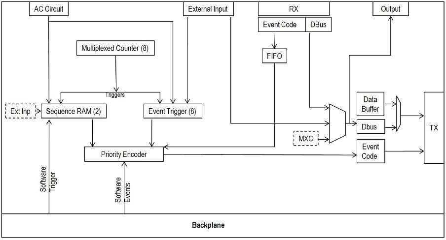
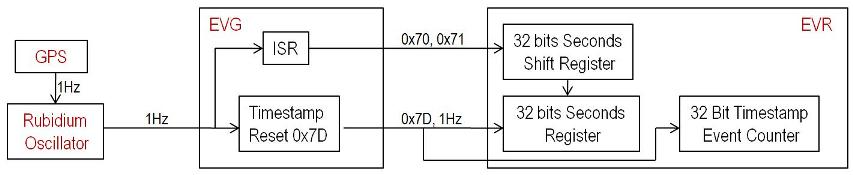
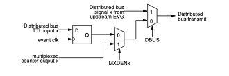
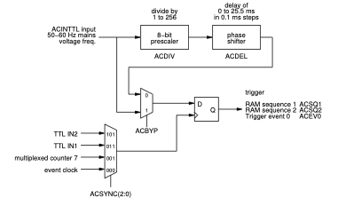
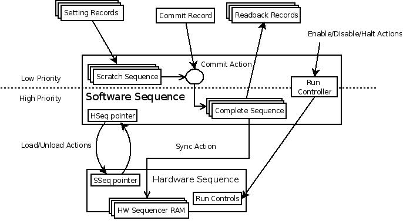

# Epics device driver for MRF Event Generator (EVG)

::: author
[Jayesh Shah, NSLS2, BNL jshah@bnl.gov]
:::

\

::: date
[Web version/RTD: January 21, 2024]
[Last Updated: September 28, 2011]
[Last Updated: Ju 28, 2011]

:::

## The Source

Source code for the mrfioc2 module, including the EVG support is available in the EPICS modules repository in Github.

VCS Checkout

```
$ git clone https://github.com/epics-modules/mrfioc2.git
```

Currently the driver supports the following models: (To be completed)

- VME-EVG-220
- VME-EVG-230
- cPCI-EVG-220
- cPCI-EVG-230
- PXI-EVG-220
- VME-EVM-300
- MTCA-EVM-300

The required software that this driver depends on:

- [EPICS Base](https://epics-controls.org/resources-and-support/base/) >= 3.14.10, 
- [devLib2](https://github.com/epics-modules/devlib2/) >= 2.8, and 
- the MSI tool (included in Base >= 3.15.1).


## IOC Deployment

This section outlines a general strategy for adding an EVG to an IOC.

### VMEbus based hardware

The VME bus based EVGs are configured using the mrmEvgSetupVME() IOC
shell function.

```
mrmEvgSetupVME (
 const char\* id, // EVG card ID
 epicsInt32 slot, // VME slot
 epicsUInt32 vmeAddress, // Desired VME address in A24 space
 epicsInt32 irqLevel // IRQ Level
 epicsInt32 irqVector, // Desired interrupt vector number
)
```
Example call:

```
mrmEvgSetupVME(EVG1,5,0x20000000,3,0x26)
```

In this example EVG1 is defined to be the VME card in slot 5 on VME
crate. It is given the A32 base address of 0x20000000 and configured to
interrupt on level 3 with vector 0x26.

You can look at example startup script(st.cmd file) for EVG in
./mrfioc2/iocBoot/iocevgmrm directory.

```{admonition} VME64x card configuration
:class: dropdown

VME64x allows for jumpless configuration of the
card, but does not support automatic assignment of resources. Selection of an
unused address range and IRQ level/vector is left to the user.

Before setup is done the VME64 identifer fields are
verified so that specifying an incorrect slot number is detected and
setup will safely abort.
```
### PCI or PCIe based hardware

For PCI (or PCIe) - based EVG or EVM, use

```
mrmEvgSetupPCI (
        const char* id,         // Card Identifier
        const char *spec,       // ID spec. or Bus number
        int d,                                  // Device number
        int f)                                  // Function number
```

## Classes/Sub-Components



### EVG

#### Global EVG Options:

-   **Enable** (bo/bi): EVG enable and disable.

#### Event Clock

All the operations on EVG are synchronized to the event clock, which is
derived from either externally provided RF clock or from an on-board
fractional synthesizer. Use of the on-board fractional synthesiser is 
mainly intended for laboratory testing purposes. 

The serial link bit rate is 20 times the event clock rate. The acceptable range for the event clock and bit rate is shown in the following table.

|         | **Event Clock** | **Bit Rate** |
| ------- | --------------- | -----------  |
| Minimum | 50 MHz | 1.0 Gb/s |
| Maximum | 142.8 MHz | 2.9 Gb/s |

*see: evgMrmApp/Db/evgEvtClk.db*

-   **Source** (bo/bi): The event clock may be derived from
    external RF clock signal or from an on-board fractional synthesizer.

-   **RF reference frequency** (ao/ai) : Set the RF Input
    frequency in MHz. Frequency can range from 50 to 1600.

-   **RF Divider** (longout/longin): Divider to derive desired
    event clock from RF reference frequency.

-   **Fractional Synthesizer frequency** (ao/ai): This
    frequency could be used to derive event clock.

-   **Event Clock Frequency Readback** (ai): Gets the current
    event clock frequency in MHz.


#### Timestamping

The Event System provides a global timebase to attach timestamps to all
collected data and performed actions at EVR. The time stamping system
consists of 32-bit timestamp event counter and a 32-bit seconds counter.

This driver provides you an option of doing timestamping calculations in
software as compared to the dedicated hardware as used at few places.



Following are the EVR requirements for accurate timestamping:

-   At the start of every second, receive the event code 0x7D which
    would load the 32-bit seconds count from shift register into the
    seconds register of EVR and reset the timestamp event counter.

-   Have the next 32-bit seconds count shifted in the shift register of
    EVR before the end of the current second. The shift register is
    updated serially by loading zeros and ones on receipt of event code
    0x70 and 0x71 respectively.

##### Timestamping at EVG:

For timestamp EVG needs a pulse from the time source at the start of
every second. EVG used this 1 pulse per second input to address both
requirements of EVR timestamping.

-   The first requirement is addressed by using Trigger Events of EVG.
    We can configure one of the trigger events to send out event code
    0x7D when it receives a pulse from the 1PPS source.

-   For addressing second requirement EVG uses software events. When
    timestamping starts the EVG driver obtains the current time from
    epicsGeneralTime interface(which inturn is synced to a accurate time
    source) and stores it locally. Now the driver uses the 1 pulse per
    second output from the time source to update the seconds count of
    the locally stored time and then sends out next second using event
    codes 0x70 and 0x71 via software events.

Driver handles different error scenarios:

-   EVG uses timer with 1PPS input signal. If it does not detect the
    signal in some '1 + delta' second the timer goes off and it raises
    an major alarm and timestamping stops. Once EVG receives the pulse
    from the 1PPS source it starts the timer again and if the timer does
    not go off for 5 consecutive pulses then the EVG starts sending
    timestamps again.

-   Before sending out the timestamps to EVR (i.e. the 32-bit seconds
    count), EVG compares the [stored time](updated by 1 PPS)
    with the [current time] (obtained from
    epicsGeneralTime). If they do not match an minor alarm is raised but
    the stored time is sent as the current time to EVR.

Advantages:

-   Using minimum number of EVG inputs for the timestamping purpose.

*see: evgMrmApp/Db/evgMrm.db*

##### Records associated with EVG time stamping:

-   **Synchronize Timestamp** (bo): Sync the current time with
    the NTP server.

-   **1PPS source** for Timestamping:

    -   **Timestamp Input** (mbbo/mbbi):

        -   None : Stop timestamping

        -   Front : Front Panel Input

        -   Univ : Universal Input

        -   Rear : Rear Transitional Input


#### Software Events

Software event is used to send out an event by writing that event code 
to a particular register in EVG.

-   **Enable** (bo/bi): Enable/Disable the transmission of
    Software Events.

-   **Event Code** (longout/longin): Sends out the event code
    onto the event stream. Event code can range from 0 to 255.

#### Trigger Events

*see: evgMrmApp/Db/evgTrigEvt.db*

Trigger events are used to send out event codes into the event stream 
every time an input trigger is received. 
The stimulus can be a rising edge on an external input
signal, a multiplexed counter output or the ac signal.

-   **Enable** (bo/bi): Enable/Disable the transmission of
    Trigger Events.

-   **Event Code** (longout/longin): Sets the event code to be
    sent out, whenever a trigger is received. Event Code can range from
    0 to 255.

-   **Trigger Source** (mbbo): The trigger could come from one
    or multiple sources. It could come from any of the external inputs
    and/or any multiplexed counter output and/or from ac signal. If
    multiple trigger sources are selected then those signal are OR'ed
    together and the resulting signal works as the trigger.

#### Distributed bus

The distributed bus allows transmission of eight simultaneous signals with 
half of the event clock rate time resolution (for example, 20 ns at 100 MHz event clock rate). 
The source for distributed bus signals may come from an external source or the signals 
may be generated with programmable multiplexed counters (MXC) inside the event generator.

The distributed bus signals may be programmed to be available as hardware outputs on the event receiver.



-   **Signal Source/Map** (mbbo): The bits of the distributed
    bus can be driven by selecting one of the following sources.

    -   Ext Inp : Sampling of the external input signals at event rate.
    -   MXC : Sampling of the corresponding multiplexed counter output
        at event rate.
    -   Upstream EVG : Forwarding the state of distributed bus bit of
        upstream EVG.

-   **Selecting the input** (bo): When the source for the
    distributed bus signals is external input signal, we need to specify
    which input signal needs to be mapped onto the distributed bus. If
    multiple inputs are mapped onto a single distributed bus bit then
    those signals are logically OR'ed together and the resulting signal
    is used to drive the distributed bus bit.

#### Multiplexed Counter

There are 8 32-bit multiplexed counters that generate clock signals with
programmable frequencies from event clock/2{sup}`32`-1 to event clock/2. The
counter outputs may be programmed to trigger events, drive distributed
bus signals and trigger sequence RAMs.


*see evgMrmApp/Db/evgMxc.db*

-   **Polarity** (bo/bi): Set the Multiplex Counter(Mxc)
    output polarity.
-   **Frequency** (ao/ai): Request a signal with a particular
    frequency.
-   **Prescaler** (longout/longin): Used as counter to produce a signal with
    a particular frequency.
-   **Reset**  Reset all the multiplexed counters. After reset all the
    counters are in phase/sync with each other.

| **Prescaler value** | **DutyCycle** | **Frequency at 125MHz Event Clock** |
| ------------------- | ------------- | ----------------------------------- |
| 0,1 not allowed | undefined | undefined |
| 2 | 50/50 | 62.5 MHz |
| 3 | 33/66 | 41.7 MHz |
| 4 | 50/50 | 31.25 MHz |
| 5 | 40/60 | 25 MHz |
| ... | ... | ... |
| 2{sup}`32`−1 | approx. 50/50 | 0.029 Hz |


#### Input

VME-EVG-230 has 2 Front panel, 4 Universal and 16 Transitional Inputs.

-   **External Input Interrupt** (bo): Enable or Disable the
    External Interrupt. When enabled, an interrupt is received on every
    rising edge the input signal.

#### Output

It is used to configure the 4 front panel outputs and 4 four front panel
universal outputs.

-   **Source**　(mbbo/mbbi): The output could be mapped to

    -   Any of the eight distributed bus bits

    -   Forced logic 1

    -   Forced logic 0.

#### AC Trigger

EVG provides synchronization to the mains voltage frequency or another
external clock.

*see: evgMrmApp/Db/evgAcTrig.db*



-   **Divider**　(longout/longin): The mains voltage frequency
    can be divided by an eight bit programmable divider.

-   **Phase**　(ao/ai): The output of the divider may be
    delayed by 0 to 25.5 ms by a phase shifter in 0.1ms steps to adjust
    the triggering position relative to mains voltage phase.

-   **AC Bypass**　(bo/bi): It is set to bypass the AC divider
    and phase shifter circuitry.

-   **Sync** (bo/bi): The AC Trigger could be synchronized
    either with event clock or the output of multiplexed counter 7.

#### Event Sequencer 

Event Sequencer provides a method of transmitting or playing back
sequences of events stored in random access memory with defined timing.
The EVG has 2 sequence RAMs (sequencers or hard sequence). The
sequencer can hold up to 2048 \<event code, mask, timeStamp\> 3-item tuples. 
When the sequencer is triggered, an internal counter starts counting. When the
counter value matches the timeStamp of the next event, the attached
event code is transmitted.
Starting with firmware version 0200 a mask field has been added. Bits in the 
mask field allow masking events from being send out based on external signal 
input states or software mask bits.

*see mrmShared/Db/mrmSoftSeq.template and evgMrmApp/Db/evgSoftSeq.template*

### Functional block diagram of device support for event sequencer 



Device support for sequencer introduces a concept of software
sequence(a.k.a. soft sequence). The existence of the software and
hardware sequences is an abstraction made to separate the process of
assembling a sequence from the process of placing it into hardware.
Software sequence maintains a complete ready to run copy of all
sequences in the IOC at all times. The IOC is then free to choose which
sequence to place into hardware. Since this is a local operation it can
be done quickly and efficiently. The IOC can have any number of these
soft sequences but at a time the number of these soft sequences that can
be loaded into the EVG hardware is restricted by the number of hardware
sequences.

As shown in the picture above IOC maintains 2 copies of sequencer data
(i.e. Event Code's, Timestamps, Trigger Source and Run Mode). Scratch
sequence and complete sequence. Users are allowed to make changes to the
scratch sequence directly. Scratch sequence is like the working copy.
When user are satisfied with the changes made to the working copy then
they can ['commit' ]the soft sequence which will update the
complete sequence with the scratch sequence. If the software sequence
has an associated hardware sequence with it then the complete sequence
is copied to the hardware on **commit**. This is the Sync
operation of sequencer.

Parts of the sequence:

-   **Event Code List**　(waveform): It is used to set the list
    of the eventCodes of the soft sequence. These eventCodes are
    transmitted whenever the timeStamp associated with eventCode matches
    the counter value of sequencer.

-   **Timestamp List**　(waveform): It is used to set the
    timeStamps for the events in the soft sequence.

-   **Timestamp Input Mode**　(bo): There are two mode to enter
    the timestamping data in the sequencer i.e. EGU and TICKS.

    -   EGU: In EGU mode user can enter the timestamps in units of
        seconds, milli-seconds, micro-seconds or nano-seconds.

    -   TICKS: Here user can provide timestamps in terms of Event Clock
        ticks.

    -   All the timestamp values are offset from the time the sequencer
        receives the trigger.

-   **Timestamp Resolution**　(mbbo) : If the timestamp input mode is EGU user
    can use this record to give the units to time.

    -   Sec - Input/Output sequencer timestamps in seconds

    -   mSec - Input/Output sequencer timestamps in micro-seconds

    -   uSec - Input/Output sequencer timestamps in milli-seconds

    -   nSec - Input/Output sequencer timestamps in nano-seconds

-   **Run Mode**　(mbbo/mbbi): Run mode is used determine what
    will the sequencer do at the end of the sequence. where mode could
    be any of the following:

    -   Single : Disarms the sequencer at the end of the sequence.

    -   Automatic : Restarts the sequence immediately after the end of
        the sequence.

    -   Normal : At the end of the sequence, the sequencer rearms and
        waits for the trigger to restart the sequence.

-   **Trigger Source**　(mbbo/mbbi): Trigger Src is used to
    select the source of the trigger, which starts the sequencer.

    -   Mxc : Trigger from MXC0 - MXC7

    -   AC : Trigger from AC sync logic

    -   Software : Trigger from RAM0/RAM1 software trigger.

    -   External : Trigger is received from any external input.

Above records only deal with the scratch copy of the soft sequence. They
do not directly interact with the hardware sequence.

A soft sequence could be in different states like LOADED or UNLOADED,
COMMITTED or DIRTY, ENABLED or DISABLED.

-   **Load**　(bo): If successful, load causes a soft sequence
    to move from UNLOADED state to LOADED state. In the LOADED state, an
    hard sequence is assigned to a soft sequence. If the soft sequence
    is already in LOADED state then load will return with an error
    message. The operation will fail if all the hard sequences are
    already assigned. An allocation scheme ensures that at any given
    time, each hard sequence is connected to only one soft sequence.
    Load also copies the last committed data to the hardware.

-   **Unload**　(bo): The unload causes the soft sequence to
    enter into UNLOADED state. This operation cannot fail. In unloaded
    state the assignment of a hard sequence to a soft sequence is
    released.

-   **Commit**　(bo): Whenever you modify a soft sequence, the
    scratch copy in the soft sequence is modified (Refer to evg-seq
    diagram). Commit causes the changes from the 'scratch sequence' to
    be copied to the 'complete sequence'. If the soft sequence is
    loaded, commit also initiates sync operation and copies the changes
    from complete sequence to the hardware. Modifying the sequenceRam
    while it is running gives undefined behavior hence 'commit' makes
    sure that the changes are not written to the hardware while it is
    running. Hence it waits for the current sequence to finish before
    writing to the hardware sequence.

-   **Enable**　(bo): It puts the soft sequence in the ENABLED
    state. In enabled state, a loaded sequence is armed and waits for
    the trigger. If is already in ENABLED state the record does nothing.

-   **Disable**　(bo): In DISABLED state the armed sequence is
    disarmed, so even if the sequencer receives the trigger the sequence
    is does not run again.

-   **Pause**　(bo): This stops the currently running
    sequence(if any) and then disarms it. Pause leaves the sequence in
    DISABLED state. When the sequence starts running again(Arm +
    Trigger), it continues the from where it was stopped.

-   **Abort**　(bo): This causes the currently running
    sequence(if any) to stop and then disarmed. Abort leaves the
    sequence in DISABLED state. After disarming it also resets the
    timestamp and eventCode registers. So when the sequence starts
    running again(Arm + Trigger), it continues the from the start.

Caveats for sequencer

-   In the Event Code and Timestamp arrays provided by user are of
    different lengths then the length of the sequence would be the
    length of the smaller of the two arrays. The remaining extra
    elements of the longer array would be ignored.

-   Driver by defaults puts the 'End of Sequence (0x7f)' event code at
    the end of the sequence and it will be sent 'evgEndOfSeqBuf' event
    clock tick after the last event in the sequence has been sent out.
    Which currently defaults to five event clock ticks. If user provides
    0x7f with a timestamp then that would be used instead of the default
    one.

-   If a soft sequence is uncommitted and running then when the IOC
    restarts the sequence would be in uncommitted state but wont be
    running i.e. last committed sequence is lost.

PyQt script. (Front end for Event Code and Timestamp arrays)

-   You need to install PyQt4 to run this python script. Debian package
    is pyqt4-dev-tools.

-   You can have timestamp as 'zero' for the first event code in the
    sequencer. So this will allow the first event code in the sequencer
    to be sent out immediately after sequencer receives the trigger. But
    adding 'zero' as timestamp anywhere else(other than for first event
    code) is an error and the sequence would be truncated as soon as a
    zero is encountered. e.g. timestamp array: 0x20, 0x30, 0, 0x40 would
    be truncated to 0x20, 0x30. (Just first two elements before zero.)

### Acknowledgment

Thanks for all the help and support

-   Michael Davidsaver, NSLS2, BNL.

-   Eric Bjorklund, LANSCE, LANL.

## EVG Device Support Reference

The following sections list the properties for all sub-units with functional descriptions.

Global
Properties in this section apply to the EVG as a whole.
See: evgMrmApp/Db/evgMrm.db

Enable
Implemented for: bo
DTYP: EVG
Master enable for the EVG. If not set then very little will happen.

Event Clock
See: evgMrmApp/Db/evgEvtClk.db

Clock Source
Implemented for: bo
DTYP: EVG Evt Clk Source
Selects either the internal fractional synthesizer, or the external clock input
(RFIN).

RF Divider
Implemented for: longout
DTYP: EVG RF Divider
Sets the programmable divider which converts the external clock input (RFIN)
to the Event clock frequency.
Valid only for the external clock source.

RF Ref. Frequency
Implemented for: ao
DTYP: EVG Clk RFref
When using the external clock input (RFIN). This property must be set to the
frequency being given to RFIN. The EVG is not able to measure this, so it must
be provided by the user.
This number is used to convert Event clock ticks into real time (nanoseconds).
An incorrect setting will result in incorrect delays and periods being calculated.

Synth. Frequency
Implemented for: ao
DTYP: EVG Clk
When using the internal fractional synthesizer this property sets the Event clock
frequency used.
If the fractional synthesizer is not able to produce the requested frequency then
it will attempt to find a frequency as close as possible.

Event Clock Frequency
Implemented for: ai
DTYP: EVG Clk
Current Event clock frequency. When using the external clock this is a readback
of the value of the RF Ref.

Frequency property.

When using the internal
fractional synthesizer this is a readback of the actual output frequency, which
may be different then what was requested with the Synth. Frequency.

9.3 AC Line Sync.
The AC Line Sync unit is a trigger source which relates to the phase of its input.
The trigger is given on the closest tick of the syncroniszation source.
Typically this is used to provide a trigger from the facility power mains.
See: evgMrmApp/Db/evgAcTrig.db

9.3.1 Divider
Implemented for: longout
DTYP: EVG AC Divider
The mains voltage frequency can be divided by an eight bit programmable
divider.

9.3.2 Phase
Implemented for: ao
DTYP: EVG AC Phase
The output of the divider may be delayed by 0 to 25.5 ms by a phase shifter in
0.1ms steps to adjust the triggering position relative to mains voltage phase.

9.3.3 Bypass
Implemented for: bo
DTYP: EVG AC Bypass
Bypass the AC divider and phase shifter circuitry. Equivalent to setting divide
by 1 and phase 0.

9.3.4 Synchronization Source
Implemented for: bo
DTYP: EVG AC Sync
The AC Trigger could be synchronized either with event clock or the output of
multiplexed counter 7.

9.4 Software Event
See: evgMrmApp/Db/evgSoftEvt.db
Implemented for: longout
DTYP: EVG Soft Evt
When processed immediately queues the code stored in the value field to be sent
over the event link. Software events have the lowest priority in the queue and
will be sent in the next otherwise empty frame.
Only one software event can be queued. If there are more then one records then
each will wait until it can queue its code, and will continue to wait until the
code is sent.

32

9.5 Event Triggers
See: evgMrmApp/Db/evgSoftEvt.db

9.6 Inputs
9.7 Outputs
9.8 DBus Bits
9.9 Multiplexed Counters
9.10 Software Sequences
9.11 Data Buffer Tx
See section 8.10.2 on page 29.
