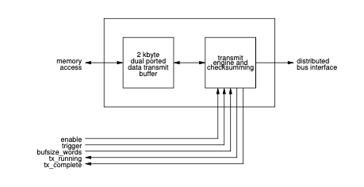
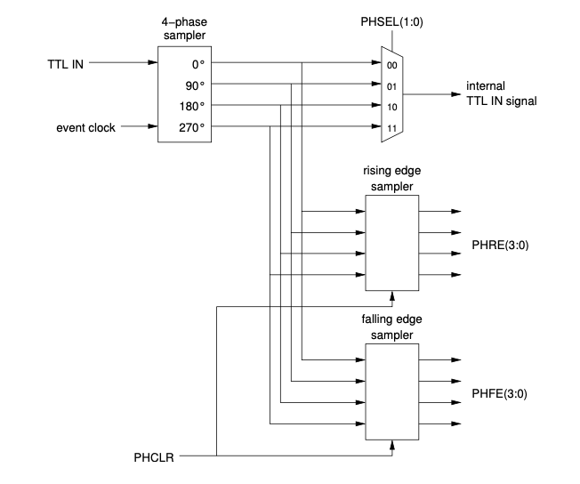

# Event Master 

Since the 300-series, Event Generator and Fanout/Concentrator are combined 
in the Event Master module that can be configured for either use; an Event Generator or Fanout-Concentrator.

Block diagram of EVM configured as an **Event Generator**:

{w=600px}

Block diagram of EVM configured as a **Fanout/Concentrator**:

{w=600px}

The essential differences are in clocking and FIFOs. 

# Fanout and Concentrator

When configured as a Fanout/Concentrator, the EVM has basically two tasks:

- Multiplying the [event stream](event-stream-protocol.md) from one input link to multiple (up to 8) output links.
- Concentrating the event streams from multiple links to one upwards link.

Fanout/concentrators play also an important role in the [delay compensation](event-system-intro.md#delay-compensation).

In EVMs configured as fan-outs [(DCMST = 0 and BCGEN = 0)](evg-registermap.md#control-register) beacons from the Timing System Master are received by the port U transceiver. The recovered event clock from the transceiver is filtered by a clock cleaner external to the FPGA. A FIFO separates the cleaned event clock domain from the recovered clock domain. The depth of the FIFO is kept constant by adjusting the phase of the cleaned clock. Beacon events are propagated through the fan-out and the propagation delay from port U to the fan-out ports 1 through 8 is measured. This delay value can be read from the IntDCValue register.

Register map for this function can be found [here](fct-registermap.md).

# Event Generator

The Event Generator generates the event stream and sends it out to an
array of Event Receivers.

The Event Generator has a number of functions:
  - Generating and transmitting the [timing events](#event-processing)
  - Transmitting the [Distributed Bus](#distributed-bus) bits
  - Transmitting the [Synchronous Data](#synchronous-data) Buffer
  - Acting as a source for [timestamps](#timestamp-support).

Events are sent out by the event generator as event frames (words) which consist of
an eight bit event code and an eight bit distributed bus data byte. 
The event transfer rate is derived from an external RF clock or optionally an on-board clock generator. 
The optical event stream transmitted by the Event Generator is phase locked to the clock reference.

Register map for Event Generator function can be found [here](evg-registermap.md).

## Event Generation

Timing events can be generated from a number of different sources: input
signals, from an internal event sequencer, software-generated
events and events received from an upstream Event Generator.

Only one event code may be transferred at a time. Should there be an event 
collision, i.e., two events should be sent at the same time, the one that 
has higher priority will be sent first. 
Event source priorities are resolved in a priority encoder.


### Trigger Signal Inputs

There are eight trigger event inputs that can be configured to send out
an event code on a stimulus. Each trigger event has its own programmable
event code register and various enable bits. The event code transmitted
is determined by contents of the corresponding event code register. The
stimulus may be a detected rising edge on an external signal or a rising
edge of a multiplexed counter output.

Trigger Event 0 has also the option of being triggered by a rising edge
of the  synchronization logic output signal (that is often used for synchronising 
with AC mains voltage). 

The external inputs accept TTL level signals. 
The input logic is edge sensitive and the signals are subsequently synchronized 
internally to the event clock.


### Event Sequencer

Event sequencers provide a method of transmitting or playing back
sequences of events stored in random access memory with defined timing.
In the event generator there are two event sequencers. 8-bit event codes
are stored in a RAM table each attached with a 32-bit timestamp (event
address) relative to the start of sequence. Both sequencers can hold up
to 2048 event code -- timestamp pairs.


Sequencer RAM Structure


The sequencer runs at the event clock rate. When the sequencer is
triggered the internal event address counter starts counting. The
counter value is compared to the event address of the next event in the
RAM table. When the counter value matches or is greater than the
timestamp in the RAM table, the attached event code is transmitted.

The time offset between two consecutive events in the RAM is allowed to
be 1 to 2{sup}`32` sequence clock cycles i.e. the internal event address
counter rolls over to 0 when 0xffffffff is reached.

Starting with firmware version 0200 a mask field has been added. Bits in
the mask field allow masking events from being send out based on
external signal input states or software mask bits. 

There are four **enable** signals:

– When mask enable bit is active ‘1’, enable event
  transmission only when HW signal is active high
  or software mask enable bit active ‘1’

And four **disable** signals:

– When mask disable bit is active ‘1’, disable event
  transmission when HW signal is active high or
  software mask disable bit is active ‘1'.

The Sequencers may be triggered from several sources including software
triggering, triggering on a multiplexed counter output or AC mains
voltage synchronization logic output.

The sequencer has three operating modes: single sequence, recycle and
recycle with re-trigger (retrigger).

In the **single sequence** mode, the sequencer runs through the table
until it reaches the end sequence code. After that, the sequencer is
disabled, the timestamp (event address) counter and the RAM address are
reset. The sequencer has to be re-enabled before it can run again.

In **recycle** mode, the sequence runs again immediately when it reaches
the end sequence code. The sequencer then restarts from the beginning of
the RAM.

In the **retrigger** mode, the sequencer stops when it reaches the end
sequence code and waits for a trigger. RAM address and timestamp counter
are both reset. When a new trigger arrives, the sequencer starts a new
run. The difference to the single sequence mode is that the sequencer
does not get disabled at end of sequence.

The sequencers are enabled by writing a '1' bit to SQxEN in the 
[Sequence RAM control Register](evg-registermap#sequence-ram-control-registers). 
The RAMs may be disabled any time by writing a '1' to SQxDIS bit. 
Disabling sequence RAMs does not reset the RAM address
and timestamp registers. By writing a '1' to the bit SQxRES in the
Control Register the sequencer is both disabled and the RAM address and
timestamp register is reset.

The contents of a sequencer RAM may be altered at any time, however, it
is recommended only to modify RAM contents when the RAM is disabled.

There are two special event codes which are not transmitted, the null
event code 0x00 and end sequence code 0x7f.

The null event code may be used if the time between two consecutive
events should exceed 2{sup}`32` event clock cycles by inserting a null event
with a timestamp value of 0xffffffff. In this case the sequencer time
will roll over from 0xffffffff to 0x00000000.

The end sequence code resets the sequencer RAM table address and
timestamp register and depending on configuration bits, disables the
sequencer (single sequence, SQxSNG=1) or restarts the sequence either
immediately (recycle sequence, SQxREC=1) or waits for a new trigger
(SQxREC=0).


#### Sequencer Interrupt Support

The sequencers provide several interrupts: a sequence start and sequence
stop interrupt and two interrupts based on the position of the
playback pointer in the sequencer RAM: a sequence halfway through
interrupt and a sequence roll-over interrupt. The sequence start
interrupt is issued when a sequencer is in enabled state, gets triggered
and was not running before the trigger. A sequence stop interrupt is
issued when the sequence is running and reaches the 'end of sequence'
code.

#### Event Priority

Events in the EVM have certain priority. An event with higher priority is sent out before lower priority events. The event priority is following:

| Event source            | Priority |
| ---------------------   | -------- |
| Upstream Event          | highest  |
| Trigger Event 0         |          |
| Trigger Event 1         |          |
| Trigger Event 2         |          |
| Trigger Event 3         |          |
| Event Sequencer 1       |          |
| Event Sequencer 2       |          |
| Trigger Event 4         |          |
| Trigger Event 5         |          |
| Trigger Event 6         |          |
| Trigger Event 7         |          |
| Beacon Event            |          |
| Software Event          |          |
| Timestamping ’0’ Event  |          |
| Timestamping ’1’ Event  |          |
| TimestampingSecondEvent | lowest   |


Each of the sources of the priority encoder has only one buffer stage that allows the pending event to wait for an empty slot.
If another event from the same source occurs before the preceding events gets sent out the earlier event is lost.

#### Uses for the sequencer 

The event sequencers are typically used for sending out a precisely
timed sequence of events, like an accelerator machine cycle. 
In this case, event codes that have been defined for different actions to
be taken during the acceleration cycle are placed in the sequencer RAM 
together with the time interval (event address) between sending out the events.
This is the most common use case for the sequencers. Typically the two sequencers
are used in foreground/background combination, where the foreground sequencer is 
transmitting events, and the background sequencer can be prepared by software 
for the upcoming cycles. When the foreground sequencer finishes, the roles can
be swapped and the backgound sequencer made active.

A more exotic use case for the sequencer could be sending out a complicated 
signal pattern, using the RAM contents in the recycle mode.

### Software-generated Events

Events can be generated in software by writing into the Software Event register.
This is useful for creating events that occur based on some higher-level conditions;
for example an operator requesting a beam dump in a circular accelerator. 

### Upstream Events

Event Generators may be cascaded. The bitstream receiver in the event generator includes
a first-in-first-out (FIFO) memory to synchronize incoming events which
may be synchronized to a clock unrelated to the event clock. Usually
there are no events in the FIFO. An event code from an upstream EVG is
transmitted as soon as there is no other event code to be transmitted.


Figure: Upstream event processing.

### Event Priority

Events in the EVM have certain priority. An event with higher priority is sent out before lower priority events. The event priority is following:
Event source
Priority
Upstream Event
Trigger Event 0
Trigger Event 1
Trigger Event 2
Trigger Event 3
Event Sequencer 1
Event Sequencer 2
Trigger Event 4
Trigger Event 5
Trigger Event 6
Trigger Event 7
Beacon Event
Software Event
Timestamping ’0’ Event Timestamping ’1’ Event TimestampingSecondEvent lowest


(distributed-bus)=
## Distributed Bus

The distributed bus allows transmission of eight simultaneous signals
with half of the event clock rate time resolution (20 ns at 100 MHz
event clock rate) from the event generator to the event receivers.

```{note} Hard/firmware before Delay Compensation
:class: dropdown

Before introduction of delay compensation, if the data transfer feature was not in use,
the highest time resolution for the distributed bus bits was equal to half of the event clock rate.
```

The source for distributed bus signals may be an external source 
or the signals may be generated with programmable [multiplexed counters](#mpx-counters) (MXC) 
inside the event generator. 
The bits of the distributed bus from external signals are sampled synchronously to the event clock. 

The distributed bus signals can be programmed 
to be available as hardware outputs on the event receiver. 

If there is an upstream EVG, the state of all distributed bus bits may be forwarded by the EVG.


Figure: Distributed Bus signal source selection.

(timestamp-support)=
## Timestamping support

The event system supports timestamping by providing:
  - Facilities to distribute a seconds value to all receivers
  - Facilities to support generation of sub-second timestamps, usually in the event clock resolution
  - Precisely latching the timestamp in an Event Receiver, on request or when an event code has been received.

The timestamp support guarantees that all event receivers (and generators) in the same distribution will have
precisely synchronized timestamp, up to the resolution of the event clock. For example, 100 MHz event clock results 
in highest timestamp resolution of 10 nanoseconds.

The seconds value to be distributed has to be provided to the Event Generator. 
This is typically sourced from an external GPS receiver. 

### Timestamp Generator

The model of time implemented by the MRF hardware is two 32-bit unsigned
integers: counter, and "seconds". The counter is maintained by each EVR
and incremented quickly. The value of the "seconds" is sent periodically
from the EVG at a lower rate.

During each "second" 33 special codes (see sec.
[Event Codes](#event-codes))
must be sent. The first 32 are the shift 0/1 codes which contain the
value of the next "second". The last is the timestamp reset event. When
received this code transfers the new "second" value out of the shift
register, and resets the counter to zero. These actions start the next
"second".

Note that while it is referred to as "seconds" this value is an
arbitrary integer which can have other meanings. Currently only one time
model is implemented, but implementing others is possible.

### Standard (aka "Light Source") Time Model

In this model the "seconds" value is an actual 1Hz counter. The software
default is the POSIX time of seconds since 1 Jan. 1970 UTC. Each new
second is started with a trigger from an external 1Hz oscillator,
usually a GPS receiver. Most GPS receivers have a one pulse per second
(PPS) output. Time is converted to the EPICS epoch (1 Jan. 1990) for use
in the IOC.

Several methods of sending the seconds value to the EVG are possible:

### External hardware

In this method, hardware is used to communicate with a GPS
receiver over a serial (RS232) link to receive the timestamp and
connect to two external inputs on the EVG. These inputs must be
programmed to send the shift 0/1 codes.

### Time from an NTP server

Time from a NTP server can be used without special hardware. This requires only a 1Hz (PPS)
signal coming from the same source as the NTP time. Several commerial
vendors supply dedicated NTP servers with builtin GPS receivers and 1Hz
outputs. A software function is provided on the EVG which is triggered
by the 1Hz signal. At the start of each second it sends the next second
(current+1), which will be latched after the following 1Hz tick.


### Timestamping Inputs

Starting from firmware version E306 a few distributed bus input signals
have dual function: transition board input DBUS5-7 can be used to
generate special event codes controlling the timestamping in Event
Receivers.


The two clocks, timestamp clock and timestamp reset clock, are assumed
to be rising edge aligned. In the EVG the timestamp reset clock is
sampled with the falling edge of the timestamp clock. This is to prevent
a race condition between the reset and clock signals. In the EVR the
reset is synchronised with the timestamp clock.

The two seconds counter events are used to shift in a 32-bit seconds
value between consecutive timestamp reset events. In the EVR the value
of the seconds shift register is transferred to the seconds counter at
the same time the higher running part of the timestamp counter is reset.

Logic has been added to automatically increment and send out the 32-bit
seconds value. Using this feature requires the two externally supplied
clocks as shown above, but the events 0x70 and 0x71 get generated
automatically.

After the rising edge of the slower clock on DBUS4, the internal seconds
counter is incremented and the 32 bit binary value is sent out LSB first
as 32 events 0x70 and 0x71. The seconds counter can be updated by
software by using the `TSValue` and `TSControl` registers.

The distributed bus event inputs can be enabled independently through
the distributed bus event enable register. The events generated through
these distributed bus input ports are given lowest priority.


(synchronous-data)=
## Configurable Size Data Buffer

A buffer of up to 2k bytes can be transmitted over the event link. This data buffer will be 
(synchronously) available to all EVRs that receive the event stream.



The data to be transmitted is stored in a 2 kbyte dual-ported memory
starting from the lowest address 0. This memory is directly accessible
via the memory interface. 

The transfer size is determined by bufsize register bits in
four byte increments. The transmission is triggered by software. Two
flags tx_running and tx_complete represent the status of transmission.
Transmission utilises two K-characters to mark the start and end of the
data transfer payload, the protocol looks following:

| **8B10B-character** | **Description** |
|-----------------    | --------------- |
|  K28.0             | Start of data transfer |
|  Dxx.x             | 1st data byte (address 0) |
|  Dxx.x             | 2nd data byte (address 1) |
|  Dxx.x             | 3rd data byte (address 2) |
|  Dxx.x             | 4th data byte (address 3) |
|  \...              | \... |
|  Dxx.x             | n{sup}`th` data byte (address n-1) |
|  K28.1             | End of data |
|  Dxx.x             | Checksum (MSB) |
|  Dxx.x             | Checksum(LSB) |

### Segmented Data Buffer Transmission

In addition to the configurable size data buffer a new way to transfer
information is provided. The segmented data buffer memory is divided into
128 segments of 16 bytes each and it is possible to transmit the
contents of a single segment or a block of consecutive segments without
affecting contents of other segments.

With the introduction of active delay compensation in 
firmware version 0200,  the use of the "data buffer mode"
has become mandatory. The active delay compensation logic does use the last segment of the
segmented data buffer memory for propagating delay compensation
information and this segment is reserved for system use.

The data to be transmitted is stored in a 2 kbyte dual-ported memory
starting from the lowest address 0. This memory is directly accessible
from the memory interface (VME, PCI). The transfer size is determined by bufsize register bits in
four byte increments. The transmission is triggered by software. Two
flags, `tx_running` and `tx_complete` represent the status of transmission.

Transmission utilises two K-characters to mark the start and end of the
data transfer payload, the protocol looks following:


| **8B10B-character** |       **Description**            |
| ------------------  |       ---------------            |
| K28.2               | Start of data transfer           |
|  Dxx.x              | Block address of 16 byte segment |
|  Dxx.x              | 1st data byte (address 0)        |
|  Dxx.x              | 2nd data byte (address 1)        |
|  Dxx.x              | 3rd data byte (address 2)        |
|  Dxx.x              | 4th data byte (address 3)        |
|  \...               | \...                             |
|  Dxx.x              | nth data byte (address n-1)      |
|  K28.1              | End of data                      |
|  Dxx.x              | Checksum (MSB)                   |
|  Dxx.x              | Checksum(LSB)                    |
                  
Segmented Data Transfer Example

#### Delay Compensation and Topology ID data

The last segment is reserved for system management and is used to
propagate delay compensation and topology data. The contents of the last
segment are represented below. Please note that the word values are in
little endian byte order.

| segment |  byte 0 - 3 |  byte 4 - 7 |  byte 8 - 11 |  byte 12 - 15 |
| ------- | ----------- | ----------- | ------------ | ------------- |
|   127   |  DCDelay    |  DCStatus   |  reserved    |  TopologyID   |

**DCDelay** represents the delay from DC master to receiving node. The
value is a fixed point number with the point between the two 16 bit
words. The delay is measured in event clock cycles.

**DCStatus** shows the quality of the delay value: 1 - initial lock, 3 -
locked with precision \< event clock cycle, 7 - fine precision.

**TopologyID** shows the geographical address of the node.

## Programmable Outputs

All the outputs are programmable: multiplexed counters and distributed
bus bits can be mapped to any output. The mapping is shown in table
below.

(mapping-id-table)=

 | MappingID   | Signal |
 | ----------- | ------------ |
 | 0 to 31     | (Reserved) |
 | 32          | Distributed bus bit 0 (DBUS0) |
 | \...        | \... |
 | 39          | Distributed bus bit 7 (DBUS7) |
 | 40          | Multiplexed Counter 0 |
 | \...        | \... |
 | 47          | Multiplexed Counter 7 |
 | 48          | AC trigger logic output |
 | 49 to 61    | (Reserved) |
 | 62          | Force output high (logic 1) |
 | 63          | Force output low (logic 0) |

## Utility Functions in the Event Generator

(mpx-counters)=
### Multiplexed Counters

Eight 32-bit multiplexed counters generate clock signals with
programmable frequencies from event clock/2{sup}`32`−1 to event clock/2.
Even divisors create 50% duty cycle signals. The counter outputs may be
programmed to trigger events, drive distributed bus signals and trigger
sequence RAMs. The output of multiplexed counter 7 is hard-wired to the
mains voltage synchronization logic.


Each multiplexed counter consists of a 32-bit prescaler register and a
31-bit count-down counter which runs at the event clock rate. When count
reaches zero, the output of a toggle flip-flop changes and the counter
is reloaded from the prescaler register. If the least significant bit of
the prescaler register is one, all odd cycles are extended by one clock
cycle to support odd dividers. The multiplexed counters may be reset by
software or hardware input. The reset state is defined by the
multiplexed counter polarity register.

| **Prescaler value** | **DutyCycle** | **Frequency at 125MHz Event Clock** |
| ------------------- | ------------- | ----------------------------------- |
| 0,1 not allowed | undefined | undefined |
| 2 | 50/50 | 62.5 MHz |
| 3 | 33/66 | 41.7 MHz |
| 4 | 50/50 | 31.25 MHz |
| 5 | 40/60 | 25 MHz |
| ... | ... | ... |
| 2{sup}`32`−1 | approx. 50/50 | 0.029 Hz |

### AC Line Synchronisation

The Event Generator provides synchronization to the mains voltage
frequency or another external clock. The mains voltage frequency can be
divided by an eight bit programmable divider. The output of the divider
may be delayed by 0 to 25.5 ms by a phase shifter in 0.1 ms steps to be
able to adjust the triggering position relative to mains voltage phase.
After this the signal synchronized to the event clock or the output of
multiplexed counter 7. The option to synchronize to an external clock
provided in front panel TTL input IN1 or IN2 has been added in firmware
version 22000207.


The phase shifter operates with a clock of 1 MHz which introduces
jitter. If the prescaler and phase shifter are not required this circuit
may be bypassed. This also reduces jitter because the external trigger
input is sampled directly with the event clock.

## Front Panel TTL Input with Phase Monitoring

Starting from firmware 22000207 a new phase select and phase monitoring
feature for the front panel TTL inputs has been added. This allows for
monitoring the signal phase and selecting the sampling point of external
signals that are phase locked to the event clock.



The external signal is sampled with four phases of the event clock, 0°,
90°, 180° and 270° and synchronized to the event clock. The signal being
used for the internal FPGA logic is selected by the PHSEL bits in the
phase monitoring register.

The phase monitoring logic detects rising and falling edges of the
incoming signal and stores the phase offset in two registers **PHRE** for
the rising edge and **PHFE** for the falling edge. The contents of the
registers are updated on each edge detected and the values can be reset
to 0000 for PHRE and 1111 for PHFE by writing a '1' to the PHCLR bit.

| PHRE value |    Rising edge position       |
| ---------- |    --------------------       |
| 0000       | Reset value, no edge detected |
| 0001       | Edge between 180° and 270°    |
| 0011       | Edge between 90° and 180°     |
| 0111       | Edge between 0° and 90°       |
| 1111       | Edge between 270° and 0°      |

| PHFE value |    Falling edge position      |
| ---------- |    ---------------------      |
| 1111       | Reset value, no edge detected |
| 1110       | Edge between 180° and 270°    |
| 1100       | Edge between 90° and 180°     |
| 1000       | Edge between 0° and 90°       |
| 0000       | Edge between 270° and 0°      |

If the input signal is phase locked to the event clock the phase
monitoring values should be stable or toggling between two values if the
signal is close to the clock sampling edge. A sampling point as far as
possible from the transition point should be selected. Selecting the
correct edge is not automated. The edge position of interest should be
monitored by the user application and the correct phase should be
selected by software.

| PHRE value |  Rising edge position         | PHSEL               |
| ---------- | --------------------------    | ------------------  |
| 0000       | Reset value, no edge detected |                     |
| 0001       | Edge between 180° and 270°    |  01, sample at 90°  |
| 0001/0011  | Edge around 180°              |  00, sample at 0°   |
| 0011       | Edge between 90° and 180°     |  00, sample at 0°   |
| 0011/0111  |  Edge around 90°              |  11, sample at 270° |
| 0111       | Edge between 0° and 90°       |  11, sample at 270° |
| 0111/1111  | Edge around 0°                |  10, sample at 180° |
| 1111       | Edge between 270° and 0°      |  10, sample at 180° |
| 1111/0001  | Edge around 270°              |  01, sample at 90°  |
 
Table: Phase Monitoring Rising Edge Select Values


| PHFE value |  Falling edge position        | PHSEL           |
| ---------- | --------------------------    | --------------- |
| 1111       | Reset value, no edge detected |
| 1110       | Edge between 180° and 270°    |  01, sample at 90°
| 1110/1100  | Edge around 180°              |  00, sample at 0°
| 1100       | Edge between 90° and 180°     |  00, sample at 0°
| 1100/1000  | Edge around 90°               |  11, sample at 270°
| 1000       | Edge between 0° and 90°       |  11, sample at 270°
| 1000/0000  | Edge around 0°                |  10, sample at 180°
| 0000       | Edge between 270° and 0°      |  10, sample at 180°
| 0000/1110  | Edge around 270°              |  01, sample at 90°

Table: Phase Monitoring Falling Edge Select Values

In the DC firmware the distributed bus is operating at half rate of the
event clock and when using an external clock with an even sub-harmonic
the phase of the distributed bus transmission is arbitrary after
restarting the system. To overcome this the phase monitoring inputs have
a status bit that shows the phase of the distributed bus on the rising
edge of the external input. The user can monitor this bit and verify
that the phase is correct each time the system is restarted. If the
phase is incorrect the phase may be toggled by writing a '1' into the
PHTOGG bit in the clock control register.


## Event Clock RF Source

All operations on the event generator are synchronised to the event
clock which is derived from an externally provided RF clock. For
laboratory testing purposes an on-board fractional synthesiser may be
used to deliver the event clock. The serial link bit rate is 20 times
the event clock rate. The acceptable range for the event clock and bit
rate is shown in the following table.

During operation the reference frequency should not be changed more than
±100 ppm.

|         | EventClock | BitRate  | 
| --      | ---------- | -------  |
| Minimum | 50 MHz     | 1.0 Gb/s |
| Maximum | 142.8 MHz  | 2.9 Gb/s |

### RF Clock and Event Clock 

The event clock may be derived from an external
RF clock signal. The front panel RF input is 50 ohm terminated and AC
coupled to a [LVPECL logic](https://en.wikipedia.org/wiki/Emitter-coupled_logic#PECL) input, so either an ECL level clock signal or
sine-wave signal with a level of maximum +10 dBm can be used.

| Divider | RF Input Frequency  | Event Clock      | Bit Rate              |
| ------- | ------------------  | -----------      | --------              |
| ÷1      | 50 MHz – 142.8 MHz  | 50 MHz–142.8 MHz | 1.0 Gb/s – 2.9 Gb/s   |
| ÷2      | 100 MHz – 285.6 MHz | 50 MHz–142.8 MHz | 1.0 Gb/s – 2.9 Gb/s   |
| ÷3      | 150 MHz – 428.4 MHz | 50 MHz–142.8 MHz | 1.0 Gb/s – 2.9 Gb/s   |
| ÷4      | 200 MHz – 571.2 MHz | 50 MHz–142.8 MHz | 1.0 Gb/s – 2.9 Gb/s   |
| ÷5      | 250 MHz – 714 MHz   | 50 MHz–142.8 MHz | 1.0 Gb/s – 2.9 Gb/s   |
| ÷6      | 300 MHz – 856.8 MHz | 50 MHz–142.8 MHz | 1.0 Gb/s – 2.9 Gb/s   |
| ÷7      | 350 MHz – 999.6 MHz | 50 MHz–142.8 MHz | 1.0 Gb/s – 2.9 Gb/s   |
| ÷8      | 400 MHz – 1.142 GHz | 50 MHz–142.8 MHz | 1.0 Gb/s – 2.9 Gb/s   |
| ÷9      | 450 MHz – 1.285 MHz | 50 MHz–142.8 MHz | 1.0 Gb/s – 2.9 Gb/s   |
| ÷10     | 500MHz–1.428GHz     | 50 MHz–142.8 MHz | 1.0 Gb/s – 2.9 Gb/s   |
| ÷11     | 550MHz–1.571GHz     | 50 MHz–142.8 MHz | 1.0 Gb/s – 2.9 Gb/s   |
| ÷12     | 600 MHz – 1.6 GHz   | 50 MHz–133  MHz  | 1.0 Gb/s – 2.667 Gb/s |
| ÷14     | 700MHz–1.6GHz *)    | 50 MHz–114 MHz   | 1.0 Gb/s – 2.286 Gb/s |
| ÷15     | 750MHz–1.6GHz *)    | 50 MHz–107 MHz   | 1.0 Gb/s – 2.133 Gb/s |
| ÷16     | 800MHz–1.6GHz *)    | 50 MHz–100 MHz   | 1.0 Gb/s – 2.0 Gb/s   |
| ÷17     | 850MHz–1.6GHz *)    | 50 MHz–94 MHz    | 1.0 Gb/s – 1.882 Gb/s |
| ÷18     | 900MHz–1.6GHz *)    | 50 MHz–88 MHz    | 1.0 Gb/s – 1.777 Gb/s |
| ÷19     | 950MHz–1.6GHz *)    | 50 MHz–84 MHz    | 1.0 Gb/s – 1.684 Gb/s |
| ÷20     | 1.0GHz–1.6GHz *)    | 50 MHz–80 MHz    | 1.0 Gb/s – 1.600 Gb/s |
| ÷21     | 1.05GHz–1.6GHz *)   | 50 MHz–76 MHz    | 1.0 Gb/s – 1.523 Gb/s |
| ÷22     | 1.1GHz–1.6GHz  *)   | 50 MHz–72 MHz    | 1.0 Gb/s – 1.454 Gb/s |
| ÷23     | 1.15GHz–1.6GHz *)   | 50 MHz–69 MHz    | 1.0 Gb/s – 1.391 Gb/s |
| ÷24     | 1.2GHz–1.6GHz  *)   | 50 MHz–66 MHz    | 1.0 Gb/s – 1.333 Gb/s |
| ÷25     | 1.25GHz–1.6GHz *)   | 50 MHz–64 MHz    | 1.0 Gb/s – 1.280 Gb/s |
| ÷26     | 1.3GHz–1.6GHz  *)   | 50 MHz–61 MHz    | 1.0 Gb/s – 1.230 Gb/s |
| ÷27     | 1.35GHz–1.6GHz *)   | 50 MHz–59 MHz    | 1.0 Gb/s – 1.185 Gb/s |
| ÷28     | 1.4GHz–1.6GHz  *)   | 50 MHz–57 MHz    | 1.0 Gb/s – 1.142 Gb/s |
| ÷29     | 1.45GHz–1.6GHz *)   | 50 MHz–55 MHz    | 1.0 Gb/s – 1.103 Gb/s |
| ÷30     | 1.5GHz–1.6GHz  *)   | 50 MHz–53 MHz    | 1.0 Gb/s – 1.066 Gb/s |
| ÷31     | 1.55GHz–1.6GHz *)   | 50 MHz–51 MHz    | 1.0 Gb/s – 1.032 Gb/s |
| ÷32     | 1.6 GHz       *)    | 50 MHz           | 1.0 Gb/s              |

RF Input Requirements

*) Range limited by [AD9515](https://www.analog.com/en/products/ad9515.html) maximum input frequency of 1.6 GHz

### Fractional Synthesiser (EVM, distribution layer)

The event master requires a reference clock to be able to synchronise on
the incoming event stream sent by the system master. A [Microchip (formerly Micrel)](https://www.microchip.com/)
[SY87739L Protocol Transparent Fractional-N Synthesiser](http://ww1.microchip.com/downloads/en/devicedoc/sy87739l.pdf) 
with a reference clock of 24 MHz is used. 

The following table lists programming bit patterns for a few frequencies. 
Please note that before programming a new operating frequency in the fractional
synthesizer the operating frequency (in MHz) has to be set in the
UsecDivider register. This is essential as the board's PLL cannot lock
if it does not know the frequency range to lock to.


|Event Rate                   | Configuration Bit Pattern | Reference Output | Precision (theoretical)|
|---------------------------  | ------------------------  | ---------------- | ---------------------- |
|142.8 MHz                    | 0x0891C100                | 142.857 MHz      | 0
|499.8 MHz/4 = 124.95 MHz     | 0x00FE816D                | 124.95 MHz       | 0
|499.654 MHz/4 = 124.9135 MHz | 0x0C928166                | 124.907 MHz      | -52 ppm
|476 MHz/4 = 119 MHz          | 0x018741AD                | 119 MHz          | 0
|106.25 MHz (fibre channel)   | 0x049E81AD                | 106.25 MHz       | 0
|499.8 MHz/5 = 99.96 MHz      | 0x025B41ED                | 99.956 MHz       | -40 ppm
|50 MHz                       | 0x009743AD                | 50.0 MHz         | 0
|499.8 MHz/10 = 49.98 MHz     | 0x025B43AD                | 49.978 MHz       | -40 ppm
|499.654MHz/4=124.9135MHz     | 0x0C928166                | 124.907MHz       | -52 ppm
|50 MHz                       | 0x009743AD                | 50.0 MHz         | 0


# Delay Compensation

With the active delay compensation feature the Event Generator and
distribution layer have been integrated into a single product, the Event
Master (EVM).


Figure 1: Timing System Topology (Active Delay Compensation, series 300)

## Topology ID

Each device in the timing system is given an unique identifier, the
Topology ID. The master EVM is given ID 0x00000000. The downstream
devices are given IDs with the least significant four bits representing
the port number the device is connected to. Each EVM left shifts its own
ID by four bits and assigns the downstream port number to the lowest
four bits to form the topology ID for the downstream devices in the next
level. The topology IDs are represented above the devices in the example
layout in figure 1.

## Active Delay Compensation

Delay compensation is achieved in measuring the propagation delay of
events from the delay compensation master EVM through the distribution
network up to the Event Receivers. At the last stage the EVR is aware of
the delay through the network and adjusts an internal FIFO depth to
match a programmed target delay value.

### Timing System Master

The top node in the Timing System has the important task to generate
periodic beacon events, to initialise and send out delay compensation
data using the segmented data buffer. Only the top node can be the
master and only one master is allowed in the system, all other EVMs have
to be initialised in fan-out mode.


Figure 2: Timing System Master

The beacon generator sends out the beacon event (code 0x7e) at a rate of
event clock/215. When the next node receives the beacon it sends it
immediately back to the master which measures the propagation delay of
the beacon event. The delay measurement precision improves with time and
takes up to 15 minutes to stabilise. The delay value (half of the loop
delay) and delay status for each SFP port is sent out using the
segmented data buffer. In case the link returning the beacon (receiving
side of port 1 through 8) is lost the measurement value is reset and the
path delay value status is invalidated. Also if the delay value between
consecutive measurements varies significantly (by more than +/- 4 event
clock cycles) the delay measurement and delay value status is reset.

### Timing System Fan-Out

In EVMs configured as fan-outs (DCMST = 0 and BCGEN = 0) beacons from
the Timing System Master are received by the port U transceiver. The
recovered event clock from the transceiver is filtered by a clock
cleaner external to the FPGA. A FIFO separates the cleaned event clock
domain from the recovered clock domain. The depth of the FIFO is kept
constant by adjusting the phase of the cleaned clock. Beacon events are
propagated through the fan-out and the propagation delay from port U to
the fan-out ports 1 through 8 is measured. This delay value can be read
from the IntDCValue register. Further on the beacon events get sent out
on the fan-out ports and returned by the next level of fan-outs or event
receivers. The loop delay for each port gets measured and the individual
port delay values (half of the loop delay value) can be read from the
registers Port1DCValue through Port8DCValue. Similar to the timing
system master if the link returning the beacon (receiving side of port 1
through 8) is lost the measurement value is reset and the path delay
value status is invalidated.


Figure: Timing System Fan-Out

The fan-out receives the delay compensation segment on the segmented
data buffer. This segment contains information about the delay value
from the Timing System Master up to this fan-out and the delay value
quality. The intergrated delay value from the Timing System Master up to
the fan-out can be retrieved from the UpDCValue register. The fan-out
modifies the delay value and delay status fields in the DC segment for
each port and sends out the new DC segments through ports 1 through 8.
