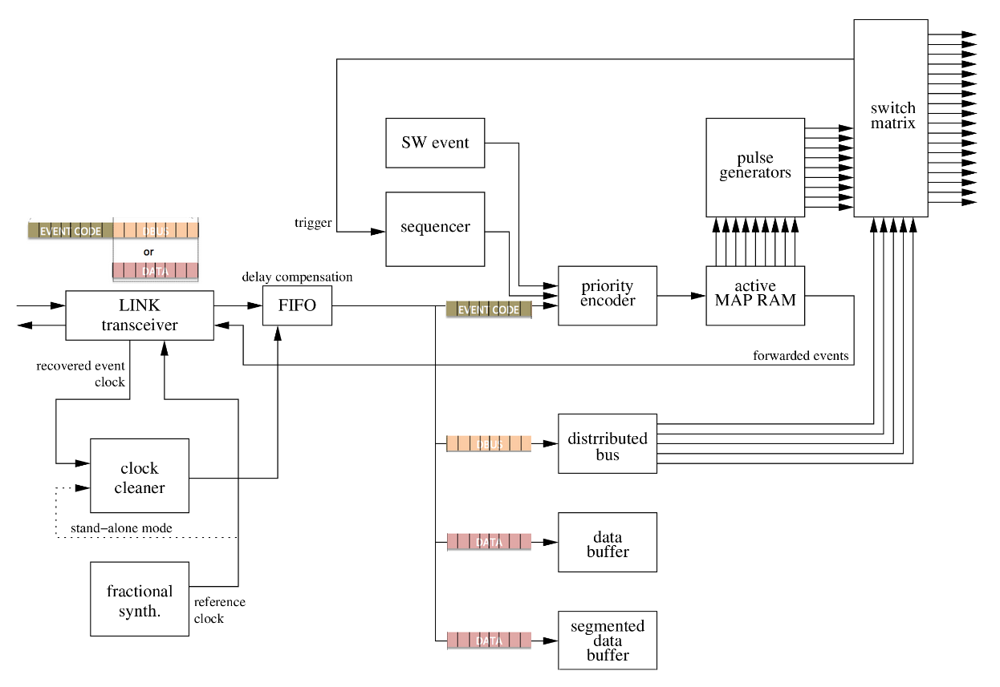
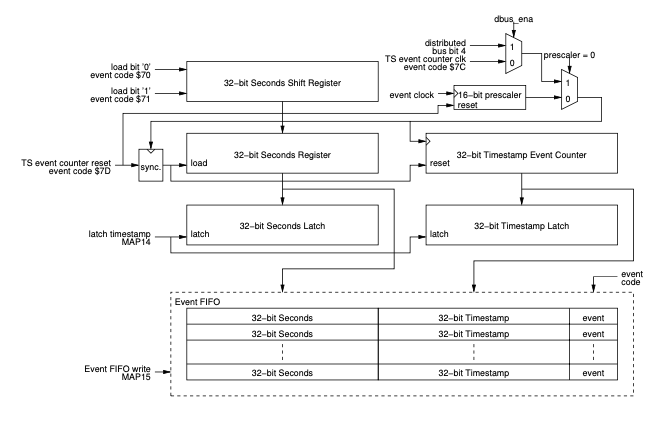
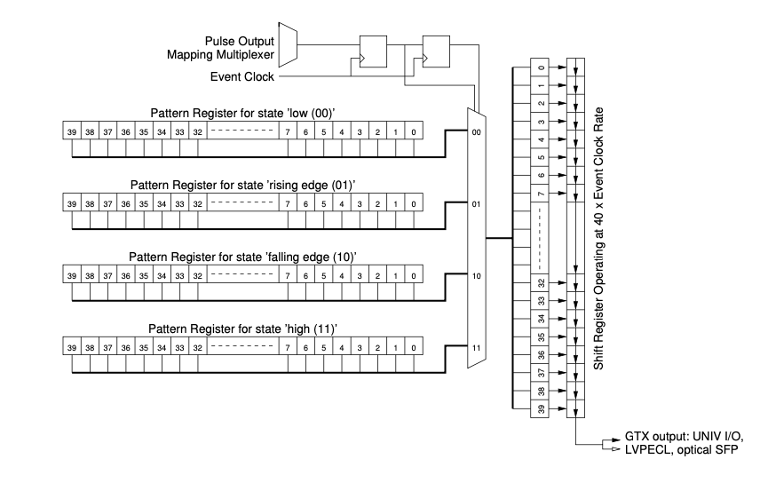

## Event Receiver

Event Receivers decode timing events and signals from an optical event
stream transmitted by an Event Generator. Events and signals are
received at predefined rate the event clock that is usually divided down
from an accelerators main RF reference. The event receivers lock to the
phase event clock of the Event Generator and are thus phase locked to
the RF reference. Event Receivers convert event codes transmitted by an
Event Generator to hardware outputs. They can also generate software
interrupts and store the event codes with globally distributed
timestamps into FIFO memory to be read by a CPU.

Block diagram of the Event Receiver (simplified).

{w=600px}

### Functional Description

After recovering the event clock the Event Receiver demultiplexes the
event stream to  8-bit event codes and 8-bit distributed bus data. The
distributed bus may be configured to share its bandwidth with time
deterministic data transmission.

(event-decoding-ram)=
### Event Decoding

The actions that the Event Receiver takes when it receives an event code are configured by means
of the Mapping RAMs. Each EVR provides two mapping RAMs of 256 × 128 bits. Only one
of the RAMs can be active at a time, however both RAMs may be modified
at any time. The event code is applied to the address lines of the active
mapping RAM. The 128-bit data programmed into a specific memory location
pointed to by the event code determines what actions will be taken.
The rough classification of actions is as described in the table below.

| Event code   | Offset | Internal functions | Pulse Triggers   | 'Set' Pulse     | 'Reset' Pulse      |
| ----------   | ------ | ------------------ | --------------   | -----------     | -------------      | 
|   0x00       | 0x0000 | 4 bytes/32 bits    | 4 bytes/32 bits  | 4 bytes/32 bits | 4 bytes/32 bits    |
|   0x01       | 0x0010 | 4 bytes/32 bits    | 4 bytes/32 bits  | 4 bytes/32 bits | 4 bytes/32 bits    |
|   0x02       | 0x0020 | 4 bytes/32 bits    | 4 bytes/32 bits  | 4 bytes/32 bits | 4 bytes/32 bits    |
|   \...       |  \...  |   \...             |   \...           |   \...          |   \...             |
|   0xFF       | 0x0FF0 | 4 bytes/32 bits    | 4 bytes/32 bits  | 4 bytes/32 bits | 4 bytes/32 bits    |

(special-function-bitmap)=
#### Function mapping

There are 32 bits (96 to 127) that are reserved for internal functions, some of which are 
by default mapped to event codes as shown in the table below. 
The remaining 96 bits control internal pulse generators. For each pulse generator there is 
one bit to trigger the pulse generator, one bit to set the pulse generator output
and one bit to clear the pulse generator output.

| Map bit    | Default event code | Function                                     |
| -------    | ------------------ | -------------------------------------------  |
| 127        | n/a                | Save event in FIFO                           |
| 126        | n/a                | Latch timestamp                              |
| 125        | n/a                | Led event                                    |
| 124        | n/a                | Forward event from RX to TX                  |
| 123        | 0x79               | Stop event log                               |
| 122        | n/a                | Log event                                    |
| 102 to 121 | n/a                | (Reserved)                                   |
| 101        | 0x7a               | Heartbeat event                              |
| 100        | 0x7b               | Reset Prescalers                             |
| 99         | 0x7d               | Timestamp reset event (TS counter reset)     |
| 98         | 0x7c               | Timestamp clock event (TS counter increment) |
| 97         | 0x71               | Seconds shift register '1'                   |
| 96         | 0x70               | Seconds shift register '0'                   |
| 80 to 95   | n/a                | (Reserved)                                   |
| 79         | n/a                | Trigger pulse generator 15                   |
| ...        | n/a                |
| 64         | n/a                | Trigger pulse generator 0                    |
| 48 to 63   | n/a                | (Reserved)                                   |
| 47         | n/a                | Set pulse generator 15 output high           |
| ...        | n/a                |
| 32         | n/a                | Set pulse generator 0 output high            |
| 16 to 31   | n/a                | (Reserved)                                   |
|      15    | n/a                | Reset pulse generator 15 output low          |
| ...        | n/a                |
| 0          | n/a                | Reset pulse generator 0 output low           |

(heartbeat-monitor)=
### Heartbeat Monitor

A heartbeat monitor is provided to receive heartbeat events. Event code
\$7A is by default set up to reset the heartbeat counter. If no
heartbeat event is received the counter times out (approx. 1.6 s) and a
heartbeat flag is set. The Event Receiver may be programmed to generate
a heartbeat interrupt at timeout.

### Event FIFO and Timestamp Events

The Event System provides a global timebase to attach timestamps to
collected data and performed actions. The time stamping system consists
of a 32-bit timestamp event counter and a 32-bit seconds counter. The
timestamp event counter either counts received timestamp counter clock
events or runs freely with a clock derived from the event clock. The
event counter is also able to run on a clock provided on a distributed
bus bit.

The event counter clock source is determined by the prescaler control
register. The timestamp event counter is cleared at the next event
counter rising clock edge after receiving a timestamp event counter
reset event. The seconds counter is updated serially by loading zeros
and ones (see mapping register bits) into a shift register MSB first.
The seconds register is updated from the shift register at the same time
the timestamp event counter is reset.

The timestamp event counter and seconds counter contents may be latched
into a timestamp latch. Latching is determined by the active event map
RAM and may be enabled for any event code. An event FIFO memory is
implemented to store selected event codes with attached timing
information. The 80-bit wide FIFO can hold up to 511 events. The
recorded event is stored along with 32-bit seconds counter contents and
32-bit timestamp event counter contents at the time of reception. The
event FIFO as well as the timestamp counter and latch are accessible by
software.

### Event Log

Up to 512 events with timestamping information can be stored in the
event log. The log is implemented as a ring buffer and is accessible as
a memory region. Logging events can be stopped by an event or software.

### Distributed Bus and Data Transmission

The distributed bus is able to carry eight simultaneous signals sampled
with half the event clock rate over the fibre optic transmission media.
The distributed bus signals may be output on programmable front panel
outputs. The distributed bus bandwidth is shared by transmission of a
configurable size data buffer to up to 2 kbytes.

(pulse-generator)=
### Pulse Generators

The structure of the pulse generation logic is shown in the figure
below. Three signals from the mapping RAM control the output of the
pulse: trigger, 'set' pulse and 'reset' pulse. A trigger causes the
delay counter to start counting, when the end-of-count is reached the
output pulse changes to the 'set' state and the width counter starts
counting. At the end of the width count the output pulse is cleared. The
mapping RAM signal 'set' and 'reset' cause the output to change state
immediately without any delay.

Starting from firmware version 0200 pulse generators can also be
triggered from rising edges of distributed bus signals or EVR internal
prescalers.

32 bit registers are reserved for both counters and the prescaler,
however, the prescaler is not necessarily implemented for all channels
and may be hard coded to 1 in case the prescaler is omitted. Software
may write 0xFFFFFFFF to these registers and read out the actual width or
hard-coded value of the register. For example, if the width counter is
limited to 16 bits a read will return 0x0000FFFF after a write of
0xFFFFFFFF.

Pulse Generator

#### Pulse Generator Gates

Depending on firmware revision/form factor a number of pulse generators
are configured as event triggered gates only and can be used to mask or
enable pulse generator triggers.

The VME-EVR-300, PCIe-EVR- 300DC and mTCA-EVR-300 have four pulse
generators configured as gates, pulse generators 28 to 31 which
correspond gates 0 to 3.

#### Pulse Generator Pulse Trains

Starting with subrelease ID 0x19 a capability of generating pulse trains has been added to the pulse generators. 
Pulse trains are enabled by specifying the number of pulse repetitions and the repeat interval. 
The pulse width is defined by the width of the initial pulse. When the number of repetitions is 0, 
the pulse generator behaves exactly the same way as in earlier firmware releases 
i.e., the total number of pulses is n+1 where n is the number of repetitions. 
Both the repeat delay (interval) and number of repetitions registers are 32 bit wide.

### Prescalers

The Event Receiver provides a number of programmable prescalers. The
frequencies are programmable and are derived from the event clock. A
special event code reset prescalers \$7B causes the prescalers to be
synchronously reset, so the frequency outputs will be in same phase
across all event receivers.

### Programmable Front Panel, Universal I/O and Backplane Connections

All outputs are programmable: each pulse generator output, prescaler and
distributed bus bit can be mapped to any output. Starting with firmware
version 0200 each output can have two sources which are logically OR'ed
together. The mapping for a single source is shown in table below.

Each output has a two byte mapping register and each byte corresponds a
single source. An unused mapping source should be set to 63 (0x3f). In
case of a bidirectional signal to tri-state set both bytes to 61 (0x3d).

Table 18: Output mapping values

  | Mapping ID  |  Signal                                                                                            |
  |------------ | ---------------------------------------------------------------------------------------------------|
  | 0 to n-1    |  Pulse generator output (number n of pulse generators depends on HW and firmware version)
  | n to 31     |  (Reserved)
  | 32          |  Distributed bus bit 0 (DBUS0)
  | \...        |  \...
  | 39          |  Distributed bus bit 7 (DBUS7)
  | 40          |  Prescaler 0
  | 41          |  Prescaler 1
  | 42          |  Prescaler 2
  | 43          |  Prescaler 3
  | 44          |  Prescaler 4
  | 45          |  Prescaler 5
  | 46          |  Prescaler 6
  | 47          |  Prescaler 7
  | 48          |  Flip-flop output 0
  | \...        |  \...
  | 55          |  Flip-flop output 7
  | 56 to 58    |  (Reserved)
  | 59          |  Event clock output (only on PXIe-EVR-300)
  | 60          |  Event clock output with 180° phase shift (only on PXIe-EVR-300)
  | 61          |  Tri-state output (for PCIe-EVR-300DC with input module populated in IFB-300's Universal I/O slot)
  | 62          |  Force output high (logic 1)
  | 63          |  Force output low (logic 0)
 
### Flip-flop Outputs (from FW version 0E0207)

There are 8 flip-flop outputs. Each of these is using two pulse
generators, one for setting the output high and the other one for
resetting the output low. In the table below you can see the
relationship between flip-flops and pulse generators and the output
mapping IDs.

  | flip-flop   | mappingID   |Set           | Reset
  | ----------- | ----------- |------------  | ------------------
  | 0           | 48          |Pulse gen. 0  | Pulse gen. 1
  | 1           | 49          |Pulse gen. 2  | Pulse gen. 3
  | 2           | 50          |Pulse gen. 4  | Pulse gen. 5
  | 3           | 51          |Pulse gen. 6  | Pulse gen. 7
  | 4           | 52          |Pulse gen. 8  | Pulse gen. 9
  | 5           | 53          |Pulse gen. 10 | Pulse gen. 11
  | 6           | 54          |Pulse gen. 12 | Pulse gen. 13
  | 7           | 55          |Pulse gen. 14 | Pulse gen. 15
 
### Front Panel Universal I/O Slots

Universal I/O slots provide different types of output with exchangeable
Universal I/O modules. Each module provides two outputs e.g. two TTL
output, two NIM output or two optical outputs. The source for these
outputs is selected with mapping registers.

### VME-EVR-300 GTX Front Panel Outputs and mTCA-EVR TCLKA/TCLKB Clocks 

The VME-EVR-300 has four GTX front panel outputs, two in Universal I/O slot
UNIV6/UNIV7 and CML outputs CML0 and CML1. The GTX Outputs provide low
jitter signals with special outputs. The outputs can work in different
configurations: pulse mode, pattern mode and frequency mode. The
difference com- pared to the CML output of the VME-EVR-230RF is that
instead of 20 bits per event clock cycle the GTX outputs have 40 bits
per event clock cycle doubling the resolution to 200 ps/bit at an event
clock of 125 MHz. 

The mTCA-EVR-300 TCLKA and TCLKB backplane clock
operate the same way as VME-EVR-300 GTX front panel outputs. The pulse
mapping is controlled through UNIV16 (TCLKA) and UNIV17 (TCLKB) mapping
registers.

### mTCA-EVR-300RF GTX Outputs

The mTCA-EVR-300RF has altogether six GTX outputs, two on the backplane, TCLKA and TCLKB, and four on the front panel: 
one Universal I/O slot (UNIV2/UNIV3), one SFP output, and one differential CML output.

The SFP output can be configured to generate a modulated signal that can be received by an 
Electron Gun trigger receiver GUN-RC-300. 
For GUN-RC-300 operation the GTX output has to be placed in GTX3MD mode (see GTX output control register).

The GUN-TX mode has a special inhibit function that by default is using Universal Input 0 as an inhibit signal. 
When the state of the inhibit signal is high the GUN-TX output is disabled. 
The inhibit function may be overridden with the GTXIO override bit in the main control register.

The mTCA-EVR-300RF also adds the capability of phase shifting all of the GTX outputs individually 
with a step resolution of 1/2560 event clock cycles. 
The phase shift is controlled by the GTX Phase Shift Offset Register.

### GTX Pulse Mode

The source for these outputs is selected in a similar way than the
standard outputs using mapping registers, however, the output logic
monitors the state of this signal and distinguishes between state low
(00), rising edge (01), high state (11) and falling edge (10). Based on
the state a 40 bit pattern is sent out with a bit rate of 40 times the
event clock rate.

-   When the source for a GTX output is low and was low one event clock
    cycle earlier (state low), the GTX output repeats the 40 bit pattern
    stored in pattern_00 register.
-   When the source for a GTX output is high and was low one event clock
    cycle earlier (state rising), the GTX output sends out the 40 bit
    pattern stored in pattern_01 register.
-   When the source for a GTX output is high and was high one event
    clock cycle earlier (state high), the GTX output repeats the 40 bit
    pattern stored in pattern_11 register.
-   When the source for a GTX output is low and was high one event clock
    cycle earlier (state falling), the GTX output sends out the 40 bit
    pattern stored in pattern_10 register.

For an event clock of 125 MHz the duration of one single GTX output bit
is 200 ps. These outputs allow for producing fine grained adjustable
output pulses and clock frequencies.

### GTX Frequency Mode

In frequency mode one can generate clocks where the clock period can be
defined in steps of 1/40th part of the event clock cycle i.e. 200 ps
step with an event clock of 125 MHz. There are some limitations,
however:

> -   Clock high time and clock low time must be ≥ 40/40th event clock
>     period steps
> -   Clock high time and clock low time must be \< 65536/40th event
>     clock period steps

The clock output can be synchronized by one of the pulse generators,
distributed bus signal etc. When a rising edge of the mapped output
signal is detected the frequency generator takes its output value from
the trigger level bit and the counter value from the trigger position
register. Thus one can adjust the phase of the synchronized clock in
1/40th steps of the event clock period. To change the generated clock
phase in respect to the trigger we can select the trigger polarity by
bit CMLTL in the CML Control register and the trigger position also in
the CML Control register.

### GTX Pattern Mode

In pattern mode one can generate arbitrary bit patterns taking into account following:

-   The pattern length is a multiple of 40 bits, where each bit is
    1/40th of the event clock period
-   Maximum length of the arbitrary pattern is 40 × 2048 bits
-   A pattern can be triggered from any pulse generator, distributed
    bus bit etc. When triggered the pattern generator starts sending
    40 bit words from the pattern memory sequentially starting from
    position 0. This goes on until the pattern length set by the
    samples register has been reached.
-   If the pattern generator is in recycle mode the pattern
    continues immediately from position 0 of the pattern memory.
-   If the pattern generator is in single pattern mode, the pattern
    stops and the 40 bit word from the last position of the pattern
    memory (2047) is sent out until the pattern generator is
    triggered again.

### GTX GUN-RC-300 Mode (mTCA-EVR-300RF)

The front panel GTX SFP output can be configured to generate a modulated signal that 
can be received by an Electron Gun trigger receiver GUN-RC-300. 
The GUN-RC-300 is capable of generating pulse trains with a quarter resolution 
of the event clock cycle (2 ns @ 125 MHz); that is, 
it allows triggering the gun bunch by bunch with a RF divider of four.

### GUN-RC-300 Pulse Mode

This mode is similar to the GTX Pulse Mode except that due to the modulation used in the GUN-RC-300 
the resolution is lower than in GTX Pulse Mode.

Here the 40 bit pattern is still used, however, it is required that in the 40 bit pattern 
five consecutive bits are of the same state that is bits 0-4 have the same state, bits 5-9 have the same state etc.

- When the source for the GTX GUN-TX output is low and waslow one event clock cycle earlier(state low), 
  the GTX output repeats the 8x5 bit pattern stored in pattern_00 register.
- When the source for the GTX GUN-TX output is high and was low one event clock cycle earlier (state rising), 
  the GTX output sends out the 8x5 bit pattern stored in pattern_01 register.
- When the source for the GTX GUN-TX output is high and was high one event clock cycle earlier (state high), 
  the GTX output repeats the 8x5 bit pattern stored in pattern_11 register.
- When the source for the GTX GUN-TX output is low and was high one event clock cycle earlier (state falling), 
  the GTX output sends out the 8x5 bit pattern stored in pattern_10 register.

By default (after power up) the four first pattern registers have the following values:

| pattern nr.  |  bit pattern                                    |
| ------------ | ------------                                    |
| 00           | ``00000 00000 00000 00000 00000 00000 00000 00000`` |
| 01           | ``11111 11111 11111 11111 11111 11111 11111 11111`` |
| 10           | ``00000 00000 00000 00000 00000 00000 00000 00000`` |
| 11           | ``11111 11111 11111 11111 11111 11111 11111 11111`` |

If for example the pattern for the rising edge(pattern_01) is changed to 
``11111 00000 11111 00000 11111 00000 11111 00000``
then the pulse start is changed to four short pulses with a stable top until the end of the pulse.
Please see 4.3 for example for setting up the mTCA-EVR-300RF in GUN-RC-300 pulse mode.

### GUN-RC-300 Pattern Mode

The pattern mode is similar to the GTX pattern mode, but like in the pulse mode the patterns are 
arranged as 8x5 bit patterns instead of fourty bit patterns.

- The pattern length is a multiple of 8x5 bits, where each 5 bit block is 1/8th of the event clock period
- Maximum length of the arbitrary pattern is 2048 event clock cycles
- A pattern can be triggered from the rising edge of any pulse generator, distributed bus bit etc. 
  When triggered the pattern generator starts sending 8x5 bit words from the pattern memory sequentially 
  starting from position 0. This goes on until the pattern length set by the samples register has been reached.
- If the pattern generator is in recycle mode the pattern continues immediately from position 0 of the pattern memory.
- If the pattern generator is in single pattern mode, the pattern stops and the 40 bit word 
  from the last position of the pattern memory (2047) is sent out until the pattern generator is triggered again.

**Common GUN-TX Mode Considerations**

- The GTX outputs should not be enable before the EVG/EVR link is up
- Disconnecting any fibre connection between EVG/EVR or EVR/GUN-RC can 
  lead to a spurious pulses at the GUN-RC
- A lost EVG RF reference can cause spurious pulses at the GUN-RC

### Configurable Size Data Buffer (EVR)

Pre-DC (Delay Compensation) event systems provided a way to to transmit
configurable size data packets that may be transmitted over the event
system link. The buffer transmission size is configured in the Event
Generator to up to 2 kbytes. The Event Receiver is able to receive
buffers of any size from 4 bytes to 2 kbytes in four byte (long word)
increments.

### Segmented Data Buffer

With the addition of delay compensation a segmented data buffer has been
introduced and it can coexist with the configurable size data buffer.
The segmented data buffer is divided into 16 byte segments that allow
updating only part of the buffer memory with the remaining segments left
untouched.

When starting a data transmission the Event Generator first sends the
starting segment number that defines the starting address in the buffer.
The data buffer address offset is the segment number \* 16 bytes. The
Event Receiver writes the received bytes into the data buffer and when
transmission is complete a receive complete flag is raised for the
starting segment of the packet transmission. The transmission can
overlap several segments, however, the flag is raised only for the
starting segment. If there is a checksum mismatch the checksum error
flag for the starting segment is set. In case the receive complete flag
already was set before the new data was received an segment overflow
flag is set. Flags are cleared by writing a '1' to the receive flag.
Each segment has a receive data counter and after completion of the
transfer the receive data counter of the starting segment is updated
with the actual number of bytes received in the transmission.

The procedure to receive a segmented data buffer is following:

-   check that receive complete flag for received segment is set
-   check that starting segment overflow flag is cleared
-   read transmission size from segment receive data counter
-   copy segment data from segmented data buffer memory into system RAM 
-   verify that starting segment overflow flag is still cleared
-   clear segment receive complete flag

Starting with firmware 0205 the delay compensation logic uses the last
16 byte segment of the segmented data buffer for delay compensation
data.

### Interrupt Generation

The Event Receiver has multiple interrupt sources which all have their
own enable and flag bits. The following events may be programmed to
generate an interrupt:

> -   Receiver link state change
> -   Receiver violation: bit error or the loss of signal.
> -   Lost heartbeat: heartbeat monitor timeout.
> -   Write operation of an event to the event FIFO.
> -   Event FIFO is full.
> -   Data Buffer reception complete.

In addition to the events listed above an interrupt can be generated
from one of the pulse generator outputs, distributed bus bits or
prescalers. The pulse interrupt can be mapped in a similar way as the
front panel outputs.

### External Event Input

An external hardware input is provided to be able to take an external
pulse to generate an internal event. This event will be handled as any
other received event.

### Programmable Reference Clock

The event receiver requires a reference clock to be able to synchronise
on the incoming event stream sent by the event generator. For
flexibility a programmable reference clock is provided to allow the use
of the equipment in various applications with varying frequency
requirements. Please note before programming a new operating frequency
with the fractional synthesizer the operating frequency (in MHz) has to
be set in the UsecDivider register. This is essential as the event
receiver's PLL cannot lock if it does not know the frequency range to
lock to.

### Fractional Synthesiser

The clock reference for the event receiver is generated on-board the
event receiver using a fractional synthesiser. A [Microchip (formerly Micrel)](https://www.microchip.com/)
[SY87739L Protocol Transparent Fractional-N Synthesiser](http://ww1.microchip.com/downloads/en/devicedoc/sy87739l.pdf) 
with a reference clock of 24 MHz is used. 
The following table lists programming bit patterns for a few frequencies.

  | Event Rate                     | Configuration Bit Pattern   | Reference Output   | Precision (theoretical)
  | ------------------------------ | --------------------------- | ------------------ | -------------------------
  | 142.8 MHz                      | 0x0891C100                  | 142.857 MHz        | 0
  | 499.8 MHz/4 = 124.95 MHz       | 0x00FE816D                  | 124.95 MHz         | 0
  | 499.654 MHz/4 = 124.9135 MHz   | 0x0C928166                  | 124.907 MHz        | -52 ppm
  | 476 MHz/4 = 119 MHz            | 0x018741AD                  | 119 MHz            | 0
  | 106.25 MHz (fibre channel)     | 0x049E81AD                  | 106.25 MHz         | 0
  | 499.8 MHz/5 = 99.96 MHz        | 0x025B41ED                  | 99.956 MHz         | -40 ppm
  | 50 MHz                         | 0x009743AD                  | 50.0 MHz           | 0
  | 499.8 MHz/10 = 49.98 MHz       | 0x025B43AD                  | 49.978 MHz         | -40 ppm
  | 499.654MHz/4=124.9135MHz       | 0x0C928166                  | 124.907MHz         | -52 ppm
  | 50 MHz                         | 0x009743AD                  | 50.0 MHz           | 0

The event receiver reference clock is required to be in ±100 ppm range
of the event generator event clock.
