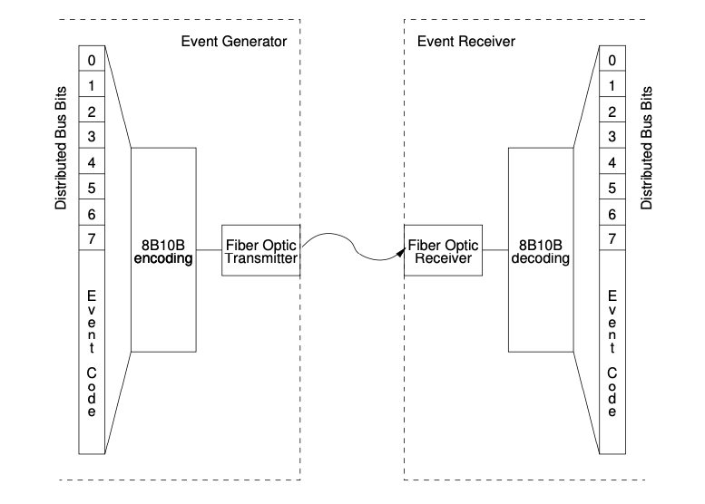

# Event Stream Details

The structure of the event stream is described to help understand the functioning of the event system. The event stream should be considered as a continuous flow of event frames which consist of two bytes, the event code and distributed bus data byte.

{w=500px}

## Protocol Details
The MRF Timing system protocol is based on [8b10b encoded](https://en.wikipedia.org/wiki/8b/10b_encoding) 
characters. Two characters are transmitted on every event clock cycle. The first encoded byte is an event code and 
the second encoded byte is shared by the distributed bus and synchronous data buffer.

Event codes are encoded as characters D01.0 through D31.7. Character D00.0 is reserved and 
transmitted when there is no event code to transmit. 
To synchronize the receivers, every fourth empty event slot is transmitted as a synchronisation character K28.5.

The data to be transmitted is stored in a 2 kbyte dual-ported memory starting from the lowest address 0. 
This memory is directly accessible from the mapped memory area. The transfer size is determined by bufsize register bits in our byte increments. The transmission is triggered by software. Two flags tx_running and tx_complete represent the status of transmission.
Transmission utilises two K-characters to mark the start and end of the data transfer payload.


The example below shows the following details:
- Synchronisation characters at cycle 0, 4, 8, 12 and 20. Please note that event code transmission overrides synchronisation character transmission at cycle 16.
- Event code transmissions at following cycles:
   - 2 - Beacon event (beacon event code is reserved and shall not be used for user events) 
   - 6 – User event code 0x10
   - 16 – User event code 0x20
- A clock with frequency event clock / 4 on distributed bus bit zero: 
   - ‘0’at cycle 0, 4, 8, 12, 16, 20
   - ‘1’ at cycle 2, 6, 10, 14, 18, 22
- Data packet transmission on the synchronous data bus:
   - Four bytes 0xC0FFEE99 are transmitted to address 0x0A0 of the data buffer

| Cycle    |  Event slot              |   Distributed Bus / Data slot  |
| -------- |  ------------------      | ------------------------------ |
| 0 K28.5  | Sync character, no event | D00.0 Distributed bus byte
| 1 D00.0  | Null event               | D00.0 Data buffer, null data
| 2 D30.3  | Beacon event             | D01.0 Distributed bus byte
| 3 D00.0  | Null event               | D00.0 Data buffer, null data
| 4 K28.5  | Sync character, no event | D00.0 Distributed bus byte
| 5 D00.0  | Null event               | K28.2 Segmented data buffer, start of transfer
| 6 D16.0  | Event code 0x10          | D01.0 Distributed bus byte
| 7 D00.0  | Null event               | D10.0 Data buffer, segment address 0xA0
| 8 K28.5  | Sync character, no event | D00.0 Distributed bus byte
| 9 D00.0  | Null event               | D00.6 Data buffer, data byte 0xC0
| 10 D00.0 | Null event               | D01.0 Distributed bus byte
| 11 D00.0 | Null event               | D31.7 Data buffer, data byte 0xFF
| 12 K28.5 | Sync character, no event | D00.0 Distributed bus byte
| 13 D00.0 | Null event               | D14.7 Data buffer, data byte 0xEE
| 14 D00.0 | Null event               | D01.0 Distributed bus byte
| 15 D00.0 | Null event               | D25.4 Data buffer, data byte 0x99
| 16 D00.1 | Event code 0x20          | D00.0 Distributed bus byte
| 17 D00.0 | Null event               | K28.1 Data buffer, end transfer
| 18 D00.0 | Null event               | D01.0 Distributed bus byte
| 19 D00.0 | Null event               | D28.7 Data buffer, checksum MSB 0xFC
| 20 K28.5 | Sync character, no event | D00.0 Distributed bus byte
| 21 D00.0 | Null event               | D25.0 Data buffer, checksum LSB 0x19
| 22 D00.0 | Null event               | D01.0 Distributed bus byte
| 23 D00.0 | Null event               | D00.0 Data buffer, null data

Checksum calculation: 0xFFFF – 0xA0 – 0xC0 – 0xFF – 0xEE – 0x99 = 0xFC19, MSB 0xFC, LSB 0x19


## Segmented Data Buffer

In addition to the configurable size data buffer a new way to transfer information is provided. 
With the introduction of active delay compensation in firmware version 0200 the use of the “data buffer mode” has become mandatory. 
The segmented data buffer memory is divided into 128 segments of 16 bytes each and it is possible to 
transmit the contents of a single segment or a block of consecutive segments without affecting contents of other segments.
The active delay compensation logic does use the last segment of the segmented data buffer memory for 
propagating delay compensation information and this segment is reserved for system use.

The contents of the last segment are represented below. Please note that the word values are in little endian byte order.

| segment | byte 0 - 3 | byte 4 - 7 | byte 8 - 11 | byte 12 - 15 |
| ------- | ---------- | ---------- | ----------- | ------------ |
|  127    | DCDelay    | DCStatus   | reserved    | TopologyID   |

**DCDelay** represents the delay from DC master to receiving node. The value is a fixed point number with the point between the two 16 bit words. The delay is measured in event clock cycles.

**DCStatus** shows the quality of the delay value: 1 - initial lock, 3 - locked with precision < event clock cycle, 7 - fine precision.

**TopologyID** shows the geographical address of the node.

```{note} Migrating to 0207 Firmware

It is important to notice that firmware version 0207 for both EVM and EVR has some changes that are
incompatible with earlier firmware versions. All components in a system have to be running either firmware 0207 or later firmware.
Major changes include:
• The delay compensation data segment has been moved from the beginning of the buffer (segment 0) to the last segment address (0x7f).
• The original non-segmented data buffer has been returned to its original memory location and the segmented data buffer has been given new addresses. The segmented data buffer is now using the K28.2 K-character as a start symbol whereas K28.0 remains for the standard data buffer. In addition to this the segmented data buffer now has a receive data length register for each segment.
```