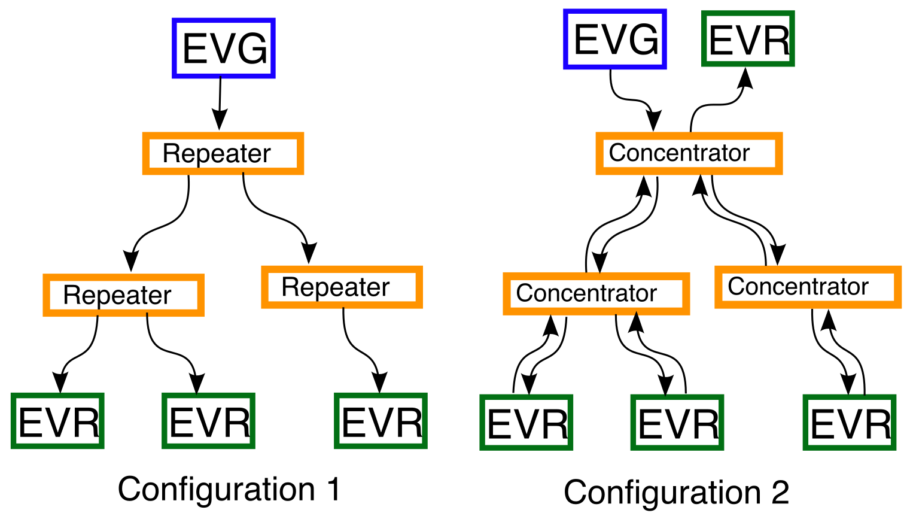
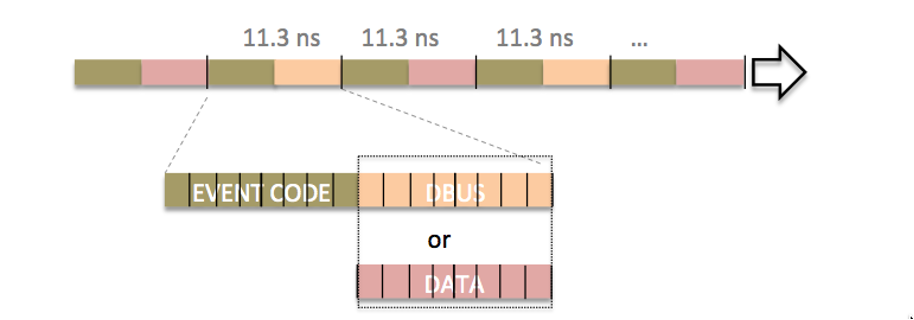
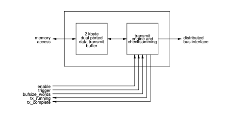
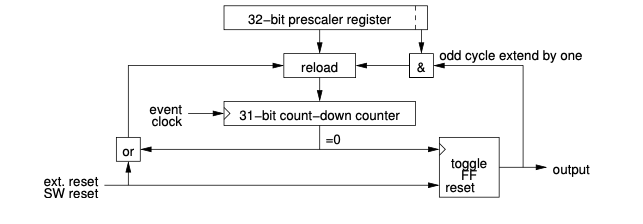
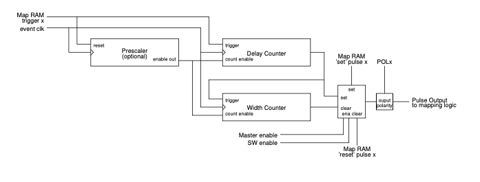
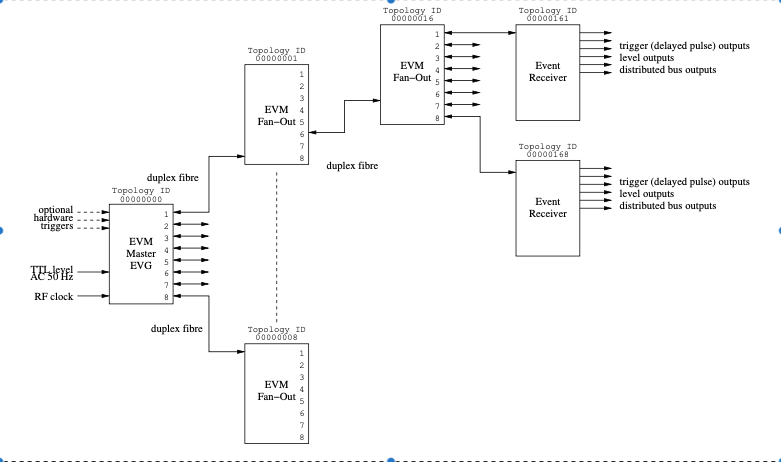
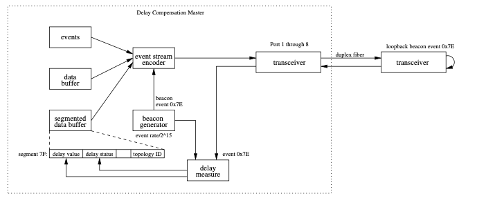

# The MRF Timing System

The MRF Event System provides a complete timing distribution system
including timing signal generation with only a few components. The
system is capable of generating subharmonic frequency signals, triggers
and sequences of events, etc. that are synchronous to an externally
provided master clock reference and (optionally) another signal, for
example mains voltage phase. Support for timestamps makes the system a
global timebase and allows attaching timestamps to collected data and
performed actions.

## Timing System Principle of Operation

A basic setup of the timing system consists of an Event Generator (EVG),
the distribution layer (Fan-Out, or Repeater/Concentrator) and Event Receivers (EVR).
See the picture below.


{w=500px}


In the basic use pattern (Configuration 1), the event stream is
unidirectional, generated by the EVG and then multiplied using repeaters
to a number of event receivers. Synchronicity is preserved in the
distribution layer. Finally, the EVRs lock to the bitstream signal phase
and thus are precisely synchronised to the bitstream, and consequently 
to each other with a high precision.

There is also the possibility for bi-directional signaling
(Configuration 2), where EVRs can not only receive the event stream but
also generate and send an event stream which will be forwarded
\"upstream\" to the EVG via the distribution layer. In the upwards
direction, the distribution layer nodes act as concentrators,
multiplexing the streams from below into one stream going upwards.
Obviously, as upstream events go through the concentrators, full determinism
cannot be guaranteed; phase synchronicity with the master clock is preserved though.

The event system functions by transmitting a bit stream, called here
event stream, between the system components. The event stream is a
continuous flow of 16-bit data frames, generated and sent out by the event
generator and sent out at the \"event clock\" rate. The event clock rate
is derived from an externally generated [RF](https://en.wikipedia.org/wiki/Radio_frequency) signal 
or optionally an on-board clock generator. 
The event stream is phase locked to the clock reference. 

The physical media for transmission is [optical fiber](https://en.wikipedia.org/wiki/Optical_fiber). 
Standard networking components ([SFP modules](https://en.wikipedia.org/wiki/Small_Form-factor_Pluggable), 
multi- or single mode fiber) are used to build the network. 
The network  is fully dedicated to timing traffic, i.e., there is no need for bandwidth sharing. 
This makes it possible for the system to react to asynchronous events without jitter, 
or the having the need to schedule operations in advance.

```{note}
In earlier versions, to use the capabilities for bi-directional
messaging, an EVR (hardware) was required to reside in the same system
as the Event Generator. In the 300-series (with [delay compensation](#delay-compensation)), the
Event Master (EVM) module contains two simplified EVRs, implemented in
firmware, in addition to the EVG. In this case, a single EVM is
sufficient for most purposes.
```

### Event Stream

The event stream protocol is based on [8b10b encoded](https://en.wikipedia.org/wiki/8b/10b_encoding) 
characters, which means that the actual bit rate is higher than the number of bits in the event frame.
Ten bits are transmitted on the link for each 8-bit byte. 

Each frame of the stream consists of two bytes. The first byte is dedicated for transmitting [timing events](#event-processing),
and always contains an [event code](#event-codes). 
The second byte can be configured for use in two different ways, as
[distributed bus](#distributed-bus) bits or [synchronous data transmission](#synchronous-data). 
These will be explained in detail later.

{w=500px}

(The above image shows a frame interval of 11.3 nanoseconds, corresponding to 88.0525 MHz event clock.)

Details about the event stream protocol can be found [here](event-stream-protocol).

## Event Generator Overview

The Event Generator generates the event stream and sends it out to an
array of Event Receivers.

The Event Generator has a number of functions:
  - Generating and transmitting the [timing events](#event-processing)
  - Transmitting the [Distributed Bus](#distributed-bus) bits
  - Transmitting the [Synchronous Data](#synchronous-data) Buffer
  - Acting as a [source for timestamps](#timestamping-support).


(event-processing)=
### Timing Events

Event codes can be understood as instructions to indicate that something 
has to happen and a corresponding action needs to be taken. The actions can be defined by the user. 

For example, in the context of an accelerator, an event
could be something like \"send a beam pulse\" and used to trigger a particle source 
to produce and feed a pulse to the accelerator. The 8-bit
event codes can be configured by the user to have different meanings.
The \"send a beam pulse\" event could be assigned the number 10, for
example.

The event code will be inserted in the event stream and distributed via the 
distribution layer to several event receivers (EVR).

On the receiving side, the EVR can be configured to act in a number of ways when it receives the code. 
Possible actions can include:
  - generating an hardware output (trigger) pulse, to trigger actions in some other components,
  - generating a software interrupt, to trigger software actions
  - actions related to managing timestamps
  - a number of other possible actions, defined in the [Event Receiver documentation](event-receiver).


(event-codes)=
#### Event Codes

A byte of 8 bits gives 256 different event codes. Actions for most of these codes can be freely configured by
the user, however a few codes have special predefined functions. The
special function event codes are listed in the table below.


| **Event Code**  | **Code Name**  | **EVG Function**  | **EVR Function**  |
| --------------  | -------------  | ----------------  | ----------------  |    
| 0x00     | Null Event Code    | \-         | \-                 |
| 0x01--0x6F       | \-                 | User Defined     | User Defined         |
| 0x70     | Seconds '0'        | \-         | Shift in '0' to LSB of Seconds Shift Register  |
| 0x71     | Seconds '1'        | \-         | Shift in '1' to LSB of Seconds Shift Register  |
| 0x72--0x78 | \-                 | User  Defined     | User Defined         |
| 0x79     | Stop Event Log     | \-         | \-                   |
| 0x7A     | Heartbeat          | \-         | \-                   |
| 0x7B     | Synchronise Prescalers       | \-         | Synchronise Prescaler Outputs    |
| 0x7C     | Timestamp Counter Increment | \-         | Increment Timestamp Counter |
| 0x7D     | Timestamp Counter Reset | \-         | \-                   |
| 0x7E     | Beacon event       | \-         | \-                   |
| 0x7F     | End of Sequence    | \-         | \-                   |
| 0x80-FF  | \-                 | User Defined | User Defined         |

Table: Event Codes


```{note}

**Beacon events** are related to the active delay compensation and **shall not** be used in user applications.

```

The event codes are transmitted continuously. If there is no other
event code to be transferred, the null event code (0x00) is transmitted.
Every now and then a special 8B10B character K28.5 is transmitted
instead of the null event code to allow the event receivers to synchronise 
on the correct word boundary on the serial bit stream.

### Sources for timing events

Timing events can be generated from a number of different sources: physical input
signals, from an internal event sequencer, software-generated
events and events received from an upstream Event Generator.


#### Trigger Signal Inputs

There are eight trigger event inputs that can be configure to send out
an event code on a stimulus. Each trigger event has its own programmable
event code register and various enable bits.


#### Event Sequencer

Event sequencers provide a method of transmitting (or "playing back")
sequences of events stored in random access memory with defined timing.
In the event generator there are two event sequencers. 8-bit event codes
are stored in a RAM table together with a 32-bit time value (event
address) relative to the start of sequence. Both sequencers can hold up
to 2048 event code -- time pairs.

The Sequencers may be triggered from several sources including software
triggering, triggering on a multiplexed counter output or AC mains
voltage synchronization logic output.


##### Uses for the sequencer 

The event sequencers are typically used for sending out a precisely
timed sequence of events, like an accelerator machine cycle. 
In this case, event codes that have been defined for different actions to
be taken during the acceleration cycle are placed in the sequencer RAM 
together with the time interval between sending out the events.
This is the most common use case for the sequencers. Typically the two sequencers
are used in foreground/background combination, where the foreground sequencer is 
transmitting events, and the background sequencer can be prepared by software 
for the upcoming cycles. When the foreground sequencer finishes, the roles can
be swapped and the backgound sequencer made active.

A more exotic use case for the sequencer could be sending out a complicated 
signal pattern, using the RAM contents in the recycle mode.

#### Software-generated Events

Events can be generated in software by writing into the Software Event register.
This is useful for creating events that occur based on some higher-level conditions;
for example an operator requesting a beam dump in a circular accelerator. 

#### Upstream Events

Event Generators may be cascaded. The bitstream receiver in the event generator includes
a first-in-first-out (FIFO) memory to synchronize incoming events which
may be synchronized to a clock unrelated to the event clock. 

(distributed-bus)=
### Distributed Bus

The distributed bus allows transmission of eight simultaneous signals
with half of the event clock rate time resolution (20 ns at 100 MHz
event clock rate) from the event generator to the event receivers.

The distributed bus signals can be programmed 
to be available as hardware outputs on the event receiver. 

Typical uses for the distributed bus are distributing hardware clock signals (that are slower that the event clock)
or distributing status signals to a large number of receivers.

(timestamp-support)=
### Timestamping support

The event system supports timestamping by providing:
  - Facilities to distribute a seconds value to all receivers
  - Facilities to support generation of sub-second timestamps, usually in the event clock resolution
  - Precisely latching the timestamp in an Event Receiver, on request or when an event code has been received.

The timestamp support guarantees that all event receivers (and generators) in the same distribution setup will have
precisely synchronized timestamps, up to the resolution of the event clock. For example, 100 MHz event clock results 
in highest timestamp resolution of 10 nanoseconds.

The seconds value to be distributed has to be provided to the Event Generator. 
This is typically sourced from an external GPS receiver. 

#### Timestamp Generator

The model of time implemented by the MRF hardware is two 32-bit unsigned
integers: counter, and "seconds". The counter is maintained by each EVR
and incremented quickly. The value of the "seconds" is sent periodically
from the EVG at a lower rate.

Note that while it is referred to as "seconds" this value is an
arbitrary integer that could have other meanings. 
Several methods of sending the seconds value to the EVG are possible:

##### External hardware

In this method, hardware is used to communicate with a GPS
receiver over a serial (RS232) link to receive the timestamp and
connect to two external inputs on the EVG. These inputs must be
programmed to send the shift 0/1 codes.

##### Time from an NTP server

Time from a NTP server can be used without special hardware. This requires only a 1Hz (PPS)
signal coming from the same source as the NTP time. Several commercial
vendors supply dedicated NTP servers with builtin GPS receivers and 1Hz
outputs. A software function is provided on the EVG which is triggered
by the 1Hz signal. At the start of each second it sends the next second
(current+1), which will be latched after the following 1Hz tick.


(synchronous-data)=
### Synchronous Data buffer

A memory buffer of up to 2k bytes can be transmitted over the event link. 
This data buffer will be (synchronously) available to all EVRs that 
receive the event stream.



The data to be transmitted is stored in a 2 kbyte dual-ported memory
starting from the lowest address 0. This memory is directly accessible
via the memory interface in both generators and receivers. 

### Utility Functions in the Event Generator

(mpx-counters)=
#### Multiplexed Counters

Eight 32-bit multiplexed counters generate clock signals with
programmable frequencies from event clock/2{sup}`32`−1 to event clock/2.
Even divisors create 50% duty cycle signals. The counter outputs may be
programmed to trigger events, drive distributed bus signals and trigger
sequence RAMs. The output of multiplexed counter 7 is hard-wired to the
mains voltage synchronization logic.



#### AC Line Synchronisation

The Event Generator provides synchronization to the mains voltage
frequency or another external clock. The mains voltage frequency can be
divided by an eight bit programmable divider. The output of the divider
may be delayed by 0 to 25.5 ms by a phase shifter in 0.1 ms steps to be
able to adjust the triggering position relative to mains voltage phase.


### Event Clock RF Source

All operations on the event generator are synchronised to the event
clock which is derived from an externally provided RF clock. For
laboratory testing purposes an on-board fractional synthesiser may be
used to deliver the event clock. The serial link bit rate is 20 times
the event clock rate. The acceptable range for the event clock and bit
rate is shown in the following table.

During operation the reference frequency should not be changed more than
±100 ppm.

|    | EventClock | BitRate | 
| -- | ---------- | ------- |
| Minimum | 50 MHz    | 1.0 Gb/s |
| Maximum | 142.8 MHz | 2.9 Gb/s |

## Event Receiver Overview

Event Receivers decode timing events and signals from an optical event
stream transmitted by an Event Generator. Events and signals are
received at the event clock rate. The event receivers lock to the
phase of the upstream clock reference. Event Receivers convert event codes 
that are transmitted by an Event Generator to hardware outputs. 
They can also generate software interrupts and store the event codes with
timestamps into FIFO memory to be read by a CPU.

### Functional Description

After recovering the event clock the Event Receiver demultiplexes the
event stream to  8-bit event codes and 8-bit distributed bus data. The
distributed bus may be configured to share its bandwidth with time
deterministic data transmission.

### Event Decoding

Actions that the Event Receiver does when an event is received are configured
by setting up [event mapping RAMs](#event-decoding-ram) in the EVR. The EVR provides two mapping RAMs 
of 256 × 128 bits each. The 128-bit data programmed into the corresponding 
memory location pointed to by the event code determines what actions will be taken.


### Heartbeat Monitor

Heartbeat facility can be used to detect the loss of communication between the EVR and the EVG.
A [heartbeat monitor](#heartbeat-monitor) is provided to receive heartbeat events. Event code
\$7A is sent by the EVG periodically to reset the heartbeat counter. If no
heartbeat event is received the counter times out (approx. 1.6 s) and a
heartbeat flag is set. The Event Receiver may be programmed to generate
a heartbeat interrupt at timeout.

### Event FIFO and Timestamp Events

The Event System provides a global timebase to attach timestamps to
collected data and performed actions. The time stamping system provides
a 32-bit timestamp event counter and a 32-bit seconds counter. The
timestamp event counter either counts received timestamp counter clock
events or runs freely with a clock derived from the event clock. The
event counter is also able to run on a clock provided on a distributed
bus bit.
When an event is received, the timestamp counters are latched and stored 
in an event FIFO. This way, a software driver can pick up the exact timestamp when
the event was received and attach it to data, for example to an EPICS record timestamp.

### Event Log

To debug or monitor the timing system performance, an event log facility is provided.
Up to 512 events with timestamping information can be stored in the
event log. The log is implemented as a ring buffer and is accessible as
a memory region. Logging events can be stopped by an event or software.

### Distributed Bus and Data Transmission

The distributed bus is able to carry eight simultaneous signals sampled
with half the event clock rate over the fibre optic transmission media.
The distributed bus signals may be output on programmable front panel
outputs. The distributed bus bandwidth is shared by transmission of a
configurable size data buffer to up to 2 kbytes.

### Pulse Generators

Programmable pulse generators give a number of ways to configure how
hardware (electrical/optical) outputs work. 
The structure of the pulse generation logic is shown in the figure
below. Three signals from the mapping RAM control the output of the
pulse: trigger, 'set' pulse and 'reset' pulse. A trigger causes the
delay counter to start counting, when the end-of-count is reached the
output pulse changes to the 'set' state and the width counter starts
counting. At the end of the width count the output pulse is cleared. The
mapping RAM signal 'set' and 'reset' cause the output to change state
immediately without any delay.



Pulse Generator

### Prescalers

The Event Receiver provides a number of programmable prescalers. The
frequencies are programmable subharmonics of the event clock. A
special event code *"reset prescalers"* (\$7B) causes the prescalers to be
synchronously reset in the whole system, so the frequency outputs will 
be in same phase across all event receivers.

### Programmable Front Panel, Universal I/O and Backplane Connections

All outputs are programmable: each pulse generator output, prescaler and
distributed bus bit can be mapped to any output. Starting with firmware
version 0200 each output can have two sources which are logically OR'ed
together.
 
### Flip-flop Outputs (from FW version 0E0207)

There are 8 flip-flop outputs. Each of these is using two pulse
generators, one for setting the output high and the other one for
resetting the output low. 

### Front Panel Universal I/O Slots

Universal I/O slots provide different types of output with exchangeable
Universal I/O modules. Each module provides two outputs e.g. two TTL
output, two NIM output or two optical outputs. The source for these
outputs is selected with mapping registers.

### Synchronous Data Transmission

Pre-DC (Delay Compensation) event systems provided a way to to transmit
configurable size data packets over the event system link. 
The buffer transmission size is configured in the Event
Generator to up to 2 kbytes, and can be filled with arbitrary data
by the host system.
The Event Receiver is able to receive buffers of any size 
from 4 bytes to 2 kbytes in four byte (long word) increments.

#### Segmented Data Buffer

With the addition of delay compensation (300-series), a segmented data buffer has been
introduced and it can coexist with the configurable size data buffer.
The segmented data buffer is divided into 16 byte segments that allow
updating only part of the buffer memory with the remaining segments left
untouched.

### External Event Input

An external hardware input is provided to be able to take an external
pulse to generate an internal event. This event will be handled as any
other received event.

(delay-compensation)=
## Delay Compensation

In the 300-series event system, an active delay compensation feature was added.
The delay compensation can be used to stabilize the system against e.g, thermal drifts
of optical cables that affect the signal propagation time in the system. 
With different cable lengths, long distances and thermal gradients, the propagation delays 
could drift and disturb operation in cases where long-term timing stability is critical.

With the active delay compensation feature the Event Generator and
distribution layer have been integrated into a single product, the Event
Master (EVM).



Figure: Timing System Topology (Active Delay Compensation, series 300)

### Topology ID

Each device in the timing system is given an unique identifier, the
Topology ID. The master EVM is given ID 0x00000000. The downstream
devices are given IDs with the least significant four bits representing
the port number the device is connected to. Each EVM left shifts its own
ID by four bits and assigns the downstream port number to the lowest
four bits to form the topology ID for the downstream devices in the next
level. The topology IDs are represented above the devices in the example
layout.

### Active Delay Compensation

Delay compensation is achieved by measuring the propagation delay of
events from the delay compensation master EVM through the distribution
network up to the Event Receivers. At the last stage the EVR is aware of
the delay through the network and adjusts an internal FIFO depth to
match a programmed target delay value.

(dc-eventmaster)=
#### Timing System Master

The top node in the Timing System has the important task to generate
periodic beacon events, to initialise and send out delay compensation
data using the segmented data buffer. Only the top node can be the
master and only one master is allowed in the system, all other EVMs have
to be initialised in fan-out mode.



Figure: Timing System Master

The beacon generator sends out beacon events (code 0x7e) at a rate of
event clock/2{sup}`15`. When the next node receives the beacon it sends it
immediately back to the master which measures the propagation delay of
the beacon event. 

(dc-fanout)=
#### Timing System Fan-Out

In EVMs configured as fan-outs, beacons from the Timing System Master 
are received by the port U transceiver. The recovered event clock from 
the transceiver is filtered by a clock cleaner external to the FPGA. 
Beacon events are propagated through the fan-out and the propagation delay 
is measured. Further on the beacon events get sent out
on the fan-out ports and returned by the next level of fan-outs or event
receivers. The loop delay for each port gets measured. 

The fan-out receives the delay compensation segment on the segmented
data buffer. This segment contains information about the delay value
from the Timing System Master up to this fan-out and the delay value
quality. The fan-out modifies the delay value and delay status fields 
in the DC segment for each port and sends out the new DC segments through 
ports 1 through 8.

(dc-event-receiver)=
#### Timing System Event Receiver

The Event Receiver receives the beacon event and returns it back
immediately. Based on the recovered event clock from the gigabit
transceiver the event receiver generates a local phase shifted and
cleaned event clock. The majority of the event receiver logic is running
in the cleaned event clock domain. A delay compensation FIFO separates
the transceiver receive logic from the main event receiver logic.


Figure 4: Timing System Event Receiver

The delay compensation segment of the segmented data buffer provides
information of the fiber path delay from the timing master up to the
event receiver. The event receiver adjusts the phase of the cleaned
event clock to control the depth of the delay compensation FIFO. 
