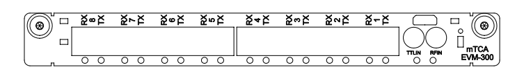

## MTCA-EVM-300 

{#mtcaevm300front}

| Connector / Led | Style | Level    |  Description |
| ----------------| ----- | -----    | ------------ |
| RFIN            | LEMO  | RF+10dBm | RF Reference Input |
| TTLIN           | LEMO  | TTL      | ACIN / TTL0 Trigger input |
| TX1             | LC    | optical  | Fan-Out Port 1 Transmit (TX 1) |
| RX1             | LC    | optical  |  Concentrator Port 1 Receiver (RX 1) |
| TX2             | LC    | optical  | Fan-Out Port 2 Transmit (TX 2) |
| RX2             | LC    | optical  |  Concentrator Port 2 Receiver (RX 2) |
| TX3             | LC    | optical  | Fan-Out Port 3 Transmit (TX 3) |
| RX3             | LC    | optical  |  Concentrator Port 3 Receiver (RX 3) |
| TX4             | LC    | optical  | Fan-Out Port 4 Transmit (TX 4) |
| RX4             | LC    | optical  |  Concentrator Port 4 Receiver (RX 4) |
| TX5             | LC    | optical  | Fan-Out Port 5 Transmit (TX 5) |
| RX5             | LC    | optical  |  Concentrator Port 5 Receiver (RX 5) |
| TX6             | LC    | optical  | Fan-Out Port 6 Transmit (TX 6) |
| RX6             | LC    | optical  |  Concentrator Port 6 Receiver (RX 6) |
| TX7             | LC    | optical  | Fan-Out Port 7 Transmit (TX 7) |
| RX7             | LC    | optical  |  Concentrator Port 7 Receiver (RX 7) |
| TX8 (UP)        | LC    | optical  | Upstream Transmit Optical Output (TX) |
| RX8 (UP)        | LC    | optical  | Upstream Receiver Optical Input (RX) |

### TTL Input Levels

The mTCA-EVM-300 has one front panel TTL input. 
The input is terminated with 50 ohm to ground and is 5V tolerant even when powered down.

Input specifications are following:

| parameter       | value |
| ---------       | ----- |
| connector type  | [LEMO EPK.00.250.NTN](https://www.lemo.com/int_en/solutions/specialties/00-nim-camac/epk-00-250-ntn.html) | 
| input impedance | 50 ohm |
| V{sub}`IH`      | > 2.3 V |
| V{sub}`IL`      | < 1.0 V |

### mTCA-EVM-300 mTCA.4 Backplane Trigger Bus Lines

The EVM can drive and receive all of the eight differential trigger bus lines on the mTCA.4 backplane, ports 17 through 20. The configuration is following:

Table: mTCA-EVM-300 mTCA.4 Backplane Trigger Bus Lines
| mTCA.4 Pin | EVM Backplane I/O Port |
| ---------- | ---------------------- |
| Rx17       |  0                     |
| Tx17       |  1                     |
| Rx18       |  2                     |
| Tx18       |  3                     |
| Rx19       |  4                     |
| Tx19       |  5                     |
| Rx20       |  6                     |
| Tx20       |  7                     |

The differential line is an input when the BPOutMap register for this line has the value 0x3d (61 decimal).

### mTCA-EVM-300 mTCA.4 Rear Transition Module Signals

The EVM supports driving and receiving signals to/from a RTM. The signal configuration is following:

Table: mTCA-EVM-300 RTM Signals

|   mTCA.4 J30/RP30 Pin | EVM RTM I/O Port        |
| A3/B3                 | n/a                     |
| C3/D3                 | n/a                     |
| E3-/F3+               | TBOut8                  |
| A4/B4                 | n/a                     |
| C4-/D4+               | TBOut9                  |
| E4-/F4+               | TBOut7                  |
| A5 SDA                | (I2C LED/GPIO control)  |
| B5 SCL                | (I2C LED/GPIO control)  |
| C5-/D5+               | TBIn9                   |
| E5-/F5+               | TBOut6                  |
| A6-/B6+               | TBIn8                   |
| C6-/D6+               | TBIn7                   |
| E6-/F6+               | TBOut5                  |
| A7-/B7+               | TBIn6                   |
| C7-/D7+               | TBIn5                   |
| E7-/F7+               | TBOut4                  |
| A8-/B8+               | TBIn4                   |
| C8-/D8+               | TBIn3                   |
| E8-/F8+               | TBOut3                  |
| A9-/B9+               | TBIn2                   |
| C9-/D9+               | TBIn1                   |
| E9-/F9+               | TBOut2                  |
| A10-/B10+             | TBIn0                   |
| C10-/D10+             | TBOut0                  |
| E10-/F10+             | TBOut1                  |

### Register Mapping

The mTCA-EVM-300 uses the following PCI IDs.

| ID name           | value  | description               |
| -------           | -----  | ---------------------     |
| PCI Vendor ID     | 0x10ee | Xilinx                    |
| PCI Device ID     | 0x7011 | Kintex 7                  |
| PCI Subdevice VID | 0x1a3e | Micro-Research Finland Oy |
| PCI Subdevice DID | 0x232c | mTCA-EVM-300              |

All EVM functions are memory mapped through PCI BAR0.

| Address         | function | description               |
| -------         | -------- | ---------------------     |
| 0x00000-0x0FFFF | EVG      | Event generator           |
| 0x10000-0x1FFFF | FCT      | Fan-out registers         |
| 0x20000-0x2FFFF | EVRD     | Downstream Event Receiver |
| 0x30000-0x3FFFF | EVRU     |  Upstream Event Receiver  |
  