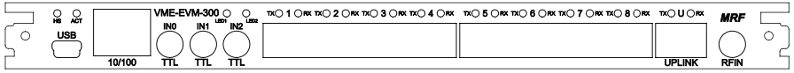

## VME-EVM-300 

{#vmeevm300front}

The front panel of the Event Generator includes the following connections and status leds:

| Connector / Led | Style | Level    |  Description |
| ----------------| ----- | -----    | ------------ |
| HS | Red Led | | Module Failure |
| HS | Blue Led | | Module Powered Down |
| ACT | 3-color Led | | SAM3X Activity Led |
| USB | Micro-USB | | SAM3X Serial port / JTAG interface |
| 10/100 | RJ45| | SAM3X Ethernet Interface |
| IN0 | LEMO | TTL | ACIN/TTL0 Trigger input |
| IN1 | LEMO | TTL | Configurable front panel input |
| IN2 | LEMO | TTL | Configurable front panel input |
| TX1             | LC    | optical  | Fan-Out Port 1 Transmit (TX 1) |
| RX1             | LC    | optical  |  Concentrator Port 1 Receiver (RX 1) |
| TX2             | LC    | optical  | Fan-Out Port 2 Transmit (TX 2) |
| RX2             | LC    | optical  |  Concentrator Port 2 Receiver (RX 2) |
| TX3             | LC    | optical  | Fan-Out Port 3 Transmit (TX 3) |
| RX3             | LC    | optical  |  Concentrator Port 3 Receiver (RX 3) |
| TX4             | LC    | optical  | Fan-Out Port 4 Transmit (TX 4) |
| RX4             | LC    | optical  |  Concentrator Port 4 Receiver (RX 4) |
| TX5             | LC    | optical  | Fan-Out Port 5 Transmit (TX 5) |
| RX5             | LC    | optical  |  Concentrator Port 5 Receiver (RX 5) |
| TX6             | LC    | optical  | Fan-Out Port 6 Transmit (TX 6) |
| RX6             | LC    | optical  |  Concentrator Port 6 Receiver (RX 6) |
| TX7             | LC    | optical  | Fan-Out Port 7 Transmit (TX 7) |
| RX7             | LC    | optical  |  Concentrator Port 7 Receiver (RX 7) |
| TX8 (UP)        | LC    | optical  | Upstream Transmit Optical Output (TX) |
| RX8 (UP)        | LC    | optical  | Upstream Receiver Optical Input (RX) |
| RFIN            | LEMO  | RF+10dBm | RF Reference Input |


### TTL Input Levels

The VME-EVM-300 has three front panel TTL inputs. 
The inputs are terminated with 50 ohm to ground and are 5V tolerant even when powered down.

Input specifications are following:

| parameter       | value |
| ---------       | ----- |
| connector type  | [LEMO EPK.00.250.NTN](https://www.lemo.com/int_en/solutions/specialties/00-nim-camac/epk-00-250-ntn.html) | 
| input impedance | 50 ohm |
| V{sub}`IH`      | > 2.3 V |
| V{sub}`IL`      | < 1.0 V |

### VME-EVM-300 VME P2 User I/O Pin Configuration

The following table lists the connections to the VME P2 User I/O Pins.

Table: VME-EVM-300 VME P2 User I/O Pin Configuration
|  Pin       | Signal |
| ---------- | -------|
| A1         |  Transition board ID0                         |
| A2         |  Transition board ID1                         |
| A3-A10     |  Ground                                       |
| A11        |  Transition board ID2                         |
| A12        |  Transition board ID3                         |
| A13-A15    |  Ground                                       |
| A16        |  Transition board handle switch               |
| A17-A26    |   Ground                                      |
| A27-A31    |  +5V                                          |
| A32        |  Power control for transition board           |
| C1         |  Transition board input 0                     |
| C2         |  Transition board input 1                     |
| C3         |  Transition board input 2                     |
| C4         |  Transition board input 3                     |
| C5         |  Transition board input 4                     |
| C6         |  Transition board input 5                     |
| C7         |  Transition board input 6                     |
| C8         |  Transition board input 7                     |
| C9         |  Transition board input 8                     |
| C10        |  Transition board input 9                     |
| C11        |  Transition board input 10                    |
| C12-C27    |  (reserved input)                             |
| C28        |  Transition board input 11                    |
| C29        |  Transition board input 12                    |
| C30        |  Transition board input 13                    |
| C31        |  Transition board input 14                    |
| C32        | Transition board input 15                     |


### VME-EVM-300 CR/CSR Support

The VME Event Generator module provides CR/CSR Support as specified in the VME64x specification. 
The CR/CSR Base Address Register is determined after reset by the inverted state of VME64x P1 connector signal pins GA4*-GA0*. 
In case the parity signal GAP* does not match the GAx* pins the CR/CSR Base Address Register is loaded with the value 0xf8 which corresponds to slot number 31.
After power up or reset the board responds only to CR/CSR accesses with its geographical address. 
Prior to accessing Event Generator functions the board has to be configured by accessing the boards CSR space.
The Configuration ROM (CR) contains information about manufacturer, board ID etc. to identify boards plugged in different VME slots. 
The following table lists the required field to locate an Event Generator module.

Table: VME-EVM-300 CR/CSR

|  CR Address | Register        | EVG  |
| ----------- | --------        | ---  |
| 0x27, 0x2B, 0x2F           | Manufacturer’s ID (IEEE OUI)  | 0x000EB2
| 0x33, 0x37, 0x3B, 0x3F     | Board ID                      | 0x4547012C

### Function 0 and 1 Registers
The Event Generator specific register are accessed via Function 0 or 1 as specified 
in the VME64x specification. 
To enable Function 0, the address decoder compare register for Function 0 in CSR space has to be programmed.

```

vmeCSRWriteADER(3, 0, (slot << 19) | (VME_AM_STD_USR_DATA << 2)); 
MrfEvgStruct *pEvg;
sysBusToLocalAdrs(VME_AM_STD_USR_DATA, (char *) (slot << 19), (void *) pEvg);

```

### Function 2 Registers

The Fan-Out/Concentrator specific register are accessed via Function 2 as specified 
in the VME64x specification. 
To enable Function 2, the address decoder compare register for Function 2 in CSR space has to be programmed.
