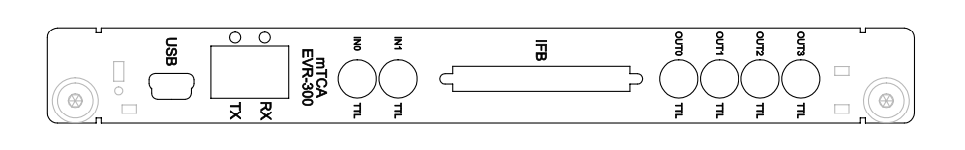

# MTCA-EVR-300

| Connector / Led | Style     | Level           | Description |
| --------------- | --------- | --------------  | ----------- |
|  USB            | Micro-USB |                 | MMC diagnostics serial port / JTAG interface
|  Link TX (SFP)  | LC        | Optical 850 nm  | Event link Transmit 
|                 |           |                 | Green: TX enable
|                 |           |                 | Red: Fract.syn. not locked
|                 |           |                 | Blue: Event out
|  Link RX (SFP)  | LC        | Optical 850 nm  | Event link Receiver
|                 |           |                 | Green: link up
|                 |           |                 | Red: link violation detected
|                 |           |                 | Blue: event led
|  IFB            | VHDCI     | LVDS            | IFB-300 Interface Box connection
|  IN0            | LEMO      | TTL             | FPTTL0 Trigger input
|  IN1            | LEMO      | TTL (3.3V / 5V) |  FPTTL1 Trigger input
|  OUT0           | LEMO      | 3.3V LVTTL      | TTL Front panel output 0
|  OUT1           | LEMO      | 3.3V LVTTL      | TTL Front panel output 1
|  OUT2           | LEMO      | 3.3V LVTTL      | TTL Front panel output 2
|  OUT3           | LEMO      | 3.3V LVTTL      | TTL Front panel output 3
|  TCLKA          | mTCA.4    | LVDS            | TCLKA clock on backplane
|                 |           |                 | This signal is driven by CML/GTX logic block 0 
|                 |           |                 | Mapped as Universal Output 16
|  TCLKB          | mTCA.4    | LVDS            | TCLKB clock on backplane
|                 |           |                 | This signal is driven by CML/GTX logic block 1
|                 |           |                 | Mapped as Universal Output 17
|  RX17           | mTCA.4    | MLVDS           | Backplane output 0
|  TX17           | mTCA.4    | MLVDS           | Backplane output 1 
|  RX18           | mTCA.4    | MLVDS           | Backplane output 2
|  TX18           | mTCA.4    | MLVDS           | Backplane output 3
|  RX19           | mTCA.4    | MLVDS           | Backplane output 4
|  TX19           | mTCA.4    | MLVDS           | Backplane output 5
|  RX20           | mTCA.4    | MLVDS           | Backplane output 6
|  TX20           | mTCA.4    | MLVDS           | Backplane output 7

