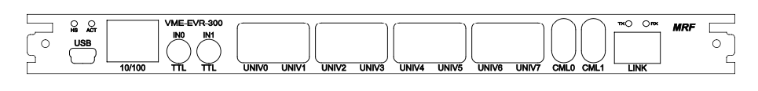

# VME-EVR-300

## VME-EVR-300 Front Panel Connections

The front panel of the Event Receiver includes the following connections and status leds:

| Connector / Led | Style          | Level           | Description  |
| --------------- | -------------- | --------------- | ------------ |
| HS              | Red Led        |                 | Module Failure
| HS              | Blue Led       |                 | Module Powered Down
| ACT             | 3-color Led    |                 | SAM3X Activity Led
| USB             | Micro-USB      |                 | SAM3X Serial port / JTAG interface
| 10/100          | RJ45           |                 | SAM3X Ethernet Interface
| IN0             | LEMO           | TTL (3.3V / 5V) | FPTTL0 Trigger input
| IN1             | LEMO           | TTL (3.3V / 5V) | FPTTL1 Trigger input
| UNIV0/1         | Universal slot |                 | Universal Output 0/1
| UNIV2/3         | Universal slot |                 | Universal Output 2/3
| UNIV4/5         | Universal slot |                 | Universal Output 4/5
| UNIV6/7         | Universal slot |                 | Universal Output 6/7
|                 |                |                 | The output signals come through CML/GTX logic block 0/1
| CML0            | LEMO EPY       | CML             | Mapped as Universal Output 8
|                 |                |                 | The output signals come through CML/GTX logic block 2
| CML1            | LEMO EPY       | CML             | Mapped as Universal Output 9
|                 |                |                 | The output signals come through CML/GTX logic block 3
| Link TX (SFP)   | LC             | Optical 850 nm  | Event link Transmit
| Link RX (SFP)   | LC             | Optical 850 nm  | Event link Receiver

#### VME TTL Input Levels

The VME-EVR-300 has two front panel TTL inputs. The inputs have a configurable input termination than
can be set by a jumper. The input can be terminated with 50 ohm to ground or 220 ohm to +3.3V. The front
panel inputs are 5V tolerant even when powered down.

Input specifications are following:

| parameter | value |
| --------- | ----- |
| connector type | LEMO EPK.00.250.NTN | 
| input impedance | 50ohm |
| V{sub}`IH` | > 2.3 V |
| V{sub}`IL` | < 1.0 V |
