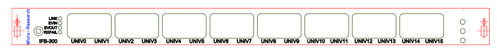

## PCIe-EVR-300DC and IFB-300 Connections

Due to its small bracket the PCIe-EVR-300DC has only a SFP transceiver and a micro-SCSI type connector
to interface to the IFB-300. The cable between the PCIe-EVR-300DC and IFB-300 should be 
connected/disconnected only when powered down.

| Connector/LED      | Style | Level          | Description                  |
| -------------      | ----- | -----          | -----------                  |
| Link TX (SFP)      | LC    | Optical 850 nm | Event link Transmit          |
|                    |       |                | Green: TX enable             |
|                    |       |                | Red: Fract.syn. not locked   |
|                    |       |                |  Blue: Event out             |
| Link RX (SFP)      | LC    | Optical 850 nm | Event link Receiver          |
| Next to micro-SCSI |       |                | Green: link up               |
|                    |       |                | Red: link violation detected |
|                    |       |                | Blue: event led              |

The interface board IFB-300 has eight Universal I/O slots which can be populated with various types of Universal I/O modules. If an input module is populated in any slot a jumper has to be mounted in that slot’s two pin header with marking “Insert jumper for input module”. Please note that if an input module is mounted the corresponding Universal Output Mapping has to be tri-stated. Refer to Table 1: Signal mapping IDs for details.
Universal Slot 0/1 signals are hard-wired to the TTLIN 0/1 signals.

| Connector/LED | Style          | Level | Description                   |
| ------------- | -----          | ----- | -----------                   |
| UNIV0/1       | Universal slot |       | TTL Input / Universal I/O 0/1 |
| UNIV2/3       | Universal slot |       | Universal I/O 2/3             |
| UNIV4/5       | Universal slot |       | Universal I/O 4/5             |
| UNIV6/7       | Universal slot |       | Universal I/O 6/7             |
| UNIV8/9       | Universal slot |       | Universal I/O 8/9             |
| UNIV10/11     | Universal slot |       | Universal I/O 10/11           |
| UNIV12/13     | Universal slot |       | Universal I/O 12/13           |
| UNIV14/15     | Universal slot |       | Universal I/O 14/15           |
| LINK          | Green LED      |       | RX link up                    |
| EVIN          | Yellow LED     |       | RX event in                   |
| EVOUT         | Yellow LED     |       | RX event led (mapped)         |
| RXFAIL        | Red LED        |       | RX violation detected         |

## PCIe-EVR-300DCS and IFB-300S Connections

Due to its small bracket the PCIe-EVR-300DCS has only a SFP transceiver and a [Samtec Eye Speed I/O](https://www.samtec.com/high-speed-cable/micro-coax-twinax/eye-speed-io/) type connector to interface to the IFB-300S. The cable between the PCIe-EVR-300DCS and IFB-300S should be connected/disconnected only when powered down.

| Connector/LED      | Style | Level          | Description                  |
| -------------      | ----- | -----          | -----------                  |
| Link TX (SFP)      | LC    | Optical 850 nm | Event link Transmit          |
|                    |       |                | Green: TX enable             |
|                    |       |                | Red: Fract.syn. not locked   |
|                    |       |                |  Blue: Event out             |
| Link RX (SFP)      | LC    | Optical 850 nm | Event link Receiver          |
| Next to Samtec connector |       |                | Green: link up               |
|                    |       |                | Red: link violation detected |
|                    |       |                | Blue: event led              |

The interface board IFB-300S has eight Universal I/O slots which can be populated with various types of Universal I/O modules. If an input module is populated in any slot a jumper has to be mounted in that slot’s two pin header with marking “Insert jumper for input module”. Please note that if an input module is mounted the corresponding Universal Output Mapping has to be tri-stated. Refer to Table 1: Signal mapping IDs for details.
Universal Slot 0/1 signals are hard-wired to the TTLIN 0/1 signals.

| Connector/LED | Style          | Level | Description                   |
| ------------- | -----          | ----- | -----------                   |
| UNIV0/1       | Universal slot |       | TTL Input / Universal I/O 0/1 |
| UNIV2/3       | Universal slot |       | Universal I/O 2/3             |
| UNIV4/5       | Universal slot |       | Universal I/O 4/5             |
| UNIV6/7       | Universal slot |       | Universal I/O 6/7             |
| UNIV8/9       | Universal slot |       | Universal I/O 8/9             |
| UNIV10/11     | Universal slot |       | Universal I/O 10/11           |
| UNIV12/13     | Universal slot |       | Universal I/O 12/13           |
| UNIV14/15     | Universal slot |       | Universal I/O 14/15           |
| LINK          | Green LED      |       | RX link up                    |
| EVIN          | Yellow LED     |       | RX event in                   |
| EVOUT         | Yellow LED     |       | RX event led (mapped)         |
| RXFAIL        | Red LED        |       | RX violation detected         |
