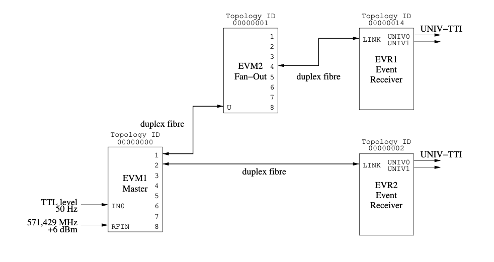

# Examples of usage scenarios

These examples use the MRF Linux API, to be found [here](https://github.com/jpietari/mrf-linux-api).
For register descriptions, see [EVG registermap](evg-registermap) or [EVR registermap](evr-registermap).

## Setting Up a Event System with Delay Compensation

In this example we are setting up a test system consisting of two VME-EVM-300 boards and to VME-
EVR-300 boards. The first EVM (EVM1) is configured as the master and the seconds EVM (EVM2) as
a fan-out. One EVR (EVR1) will be connected to the master (EVM1) and the other EVR (EVR2) to the
fan-out (EVM2). The example setup is represented here:



Figure: Example Setup

### Initializing Master EVG

First we need to configure the master EVG to use the external RF input reference clock divided by four.
After changing the clock source we need to reload the fractional synthesizer control word to force an internal
reset.

The next step is to tell the top EVG that it is the master EVG and enable its beacon generator and delay
compensation master responsibilities. Please note that the highest EVG in the system has to be the system
master and if delay compensation is used it also has to have the beacon generator enabled. Only one
EVG/EVM can be the system master and only one EVG is allowed to have the beacon generator enabled.

```
API calls                            Register access 

EvgSetRFInput(evm1, 1, 3);       # *(evm1+0x50) = 0xc1030000;
EvgSetFracDiv(evm1, 0x0891c100); # *(evm1+0x80) = 0x0891c100;
EvgSystemMasterEnable(evm1, 1);  # *(evm1+0x04) = 0xe0c00000;
EvgBeaconEnable(evm1, 1);
EvgEnable(evm1, 1);
```
### Initializing VME-EVM-300 as Fan-Out

The downstream EVM has to be configured to use the upstream EVG/EVM clock as its event clock and
after this we need to (re)load the fractional synthesizer control word.

We enable the EVM and please note that both the system master bit and beacon generator bit are disabled.

```
API calls                        Register access

EvgSetRFInput(evm2, 4, 0x0c);    # *(evm2+0x50) = 0xc40c0000;
EvgSetFracDiv(evm2, 0x0891c100); # *(evm2+0x80) = 0x0891c100;
EvgEnable(evm2, 1);              # *(evm2+0x04) = 0xe0000000;
```
### Initializing VME-EVR-300

We start with setting the fractional synthesizer operating frequency (reference for event clock) so that the
EVR can lock to the received event stream.

The delay compensation logic measures/calculates a path delay from the master EVM/EVG to the EVR
which consist of internal delays and fibre delays. The EVR has a receive FIFO and it adjusts the delay of
this FIFO based on a target delay value and the actual path delay value. The delay value is a 32 bit value
with a 16 bit integer part and a 16 bit fractional part. The integer part represents the delay in event clock
cycles i.e. a value of 0x00010000 corresponds to an actual delay of one event clock cycle which at this
examples rate is 7 ns.

In this example we set the target delay to 0x02100000 which is 3.696μs.

```
 API calls                            Register access 
 
 EvrSetFracDiv(evr1, 0x0891c100);     # *(evr1+0x80) = 0x0891c100;
 EvrSetTargetDelay(evr1, 0x02100000); # *(evr1+0xb0) = 0x02100000;
 EvrGetViolation(evr1, 1);            # *(evr1+0x08) = 0x00000001;
 EvrDCEnable(evr1, 1);                # *(evr1+0x04) = 0x80400000;
 EvrEnable(evr1, 1); |
```

The datapath delay value can be read from the EVR DCRxValue register at offset 0x0b8. For the example
above with 2 m fiber patches the measured datapath delay value shows 0x0032cff0 (355.686 ns) for EVR1
and 0x00125eea (128.595 ns) for EVR2.

## Generating an Event from AC input

A 50 Hz TTL level square wave signal is provided to the IN0 input on EVM1. We setup the input AC input
divider to divide by 5, set the AC input logic to trigger event trigger 0 and we configure event trigger 0 to
send out event code 0x01.

```
API calls                             Register access

EvgSetACInput(evm1, 0, 0, 5, 0);      # *(evm1+0x10) = 0x00000500;
EvgSetACMap(evm1, 0);                 # *(evm1+0x14) = 0x00000001;
EvgSetTriggerEvent(evm1, 0, 0x01, 1); # *(evm1+0x100) = 0x00000101;
```
## Receiving an Event and Generating an Output Pulse

To generate a pulse on a received event code in the EVR we need to setup the mapping RAM to trigger a
pulse generator on an event and setup the pulse generator. We also need to map the pulse generator to the
actual hardware output.


```
API calls                                      Register access

EvrSetPulseMap(evr1, 0, 0x01, 0, -1, -1);      # *(evr1+0x4014) = 0x00000001;
EvrSetPulseParams(evr1, 0, 0, 0, 1000);        # *(evr1+0x20C) = 0x000003e8;
EvrSetPulseProperties(evr1, 0, 0, 0, 0, 1, 1); # *(evr1+0x200) = 0x00000003;
EvrSetUnivOutMap(evr1, 0, 0x3f00);             # *(evr1+0x440) = 0x3f003f3f;
EvrMapRamEnable(evr1, 0, 1);                   # *(evr1+0x04) = 0x88400200;
EvrOutputEnable(evr1, 1);
```
Now we should see a 7μs pulse on EVR1 UNIV0 output with a rate of 10 Hz. If we configure EVR2 the
same way as the EVR1 in this example we should see a similar pulse on its UNIV0 output aligned with the
output of EVR1.


## Event Receiver Standalone Operation

Starting from firmware version 0207 capability to use the EVR as a stand-alone unit has been added. 
Functionality includes:

- Using the internal fractional synthesizer clock as a reference clock
- Generating internal events by software
- Generating internal event by one EVG type sequencer
- Generating internal event by external signals
- Internal events may be sent out on the TX link by setting the FWD bit for each event in the active
    mapping RAM

The example code below has been written for the mTCA-EVR-300, but with minor changes (remapping the
outputs) it can be used for other form factors as well.

```
int evr_sa(volatile struct MrfErRegs *pEr)
{
  int i;
  EvrEnable(pEr, 1);
  if (!EvrGetEnable(pEr))
  {
    printf(ERROR_TEXT "Could not enable EVR!\n");
    return -1;
  }
  EvrSetIntClkMode(pEr, 1);
  /* Build configuration for EVR map RAMS */
  {
    int ram,code;
    /* Setup MAP ram: event code 0x01 to 0x04 trigger pulse generators 0 through 3*/
    ram = 0;
    for (i = 0; i < 4; i++)
  {
     code = 1+i;
     EvrSetLedEvent(pEr, ram, code, 1);
     /* Pulse Triggers start at code 1 */
     EvrSetPulseMap(pEr, ram, code, i, -1, -1);
  }
  /* Setup pulse generators and front panel TTL outputs*/
  for (i = 0; i < 4; i++)
  {
    EvrSetPulseParams(pEr, i, 1, 100, 100);
    EvrSetPulseProperties(pEr, i, 0, 0, 0, 1, 1);
    EvrSetFPOutMap(pEr, i, 0x3f00 | i);
  }

  /* Setup Prescaler 0 */
  EvrSetPrescaler(pEr, 0, 0x07ffff);
  /* Write some RAM events*/
  EvrSetSeqRamEvent(pEr, 0, 0, 0, 1);
  EvrSetSeqRamEvent(pEr, 0, 1, 0x001ff, 2);
  EvrSetSeqRamEvent(pEr, 0, 2, 0x002ff, 3);
  EvrSetSeqRamEvent(pEr, 0, 3, 0x003ff, 4);
  EvrSetSeqRamEvent(pEr, 0, 4, 0x04000, 0x7f);
   /* Setup sequence RAM to trigger from prescaler 0 */
  EvrSeqRamControl(pEr, 0, 1, 0, 0, 0, C_EVR_SIGNAL_MAP_PRESC+0);
  EvrMapRamEnable(pEr, 0, 1);
  EvrOutputEnable(pEr, 1);
  return 0;
}
```

## mTCA-EVR-300RF GUN-TX/GUN-RC-300 Pulse Mode Example

This example is using the shell wrapper functions in the mrf-linux-api available 
on https://github. com/jpietari/mrf-linux-api.

```
./EvrSetEventFrequency /dev/era3 124.95
./EvrGetViolation /dev/era3 1
./EvrEnable /dev/era3 1
./EvrMapRamEnable /dev/era3 0 1
./EvrGetViolation /dev/era3 1
# Setup Map RAM0 to trigger pulse generator 0 on event 2
./EvrSetPulseMap /dev/era3 0 2 0 -1 -1
# Setup 10 event clock cycle long pulse on pulse generator 0
./EvrSetPulseParams /dev/era3 0 0 0 10
./EvrSetPulseProperties /dev/era3 0 0 0 0 1 1
# Map Pulse genrator 0 to UNIV0
./EvrSetUnivOutMap /dev/era3 1 0x3f00
# Map Pulse genrator 0 also to SFP GTX
# SFP GTX is on Universal Output 20
./EvrSetUnivOutMap /dev/era3 20 0x3f00
# Map Pulse genrator 0 also to CML GTX
# CML GTX is on Universal Output 21
./EvrSetUnivOutMap /dev/era3 21 0x3f00
# Override inhibit signal on UNIVIN0
./EvrSetGunTxInhibitOverride /dev/era3 1
# Set SFP GTX into GUN-RC-300 mode
./EvrSetCMLMode /dev/era3 4 0x3800
# Enable SFP GTX output
./EvrCMLEnable /dev/era3 4 1
# For testing purposes it is possible to look at the GTX modulation
# on the CML outputs:
#./EvrSetCMLMode /dev/era3 5 0x3800
./EvrCMLEnable /dev/era3 5 1
# Set Phase offset 0-2559, steps of 8 ns/2560 = 3.125 ps
./EvrSetCMLPhaseOffset /dev/era3 4 1000}
```
